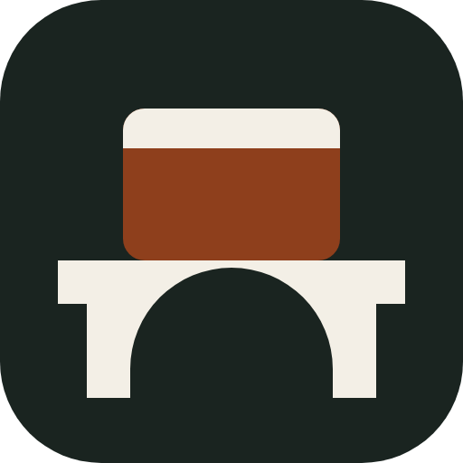

  

<h1 align="center">AppBridge</h1>

<strong>Instale uma vez. Publique para todos.</strong>

Aplicativos Windows do servidor aparecem no PC do escritório como atalho local, com janela própria, permissão central e auditoria. Sem entregar o desktop remoto.

---

Escritórios de contabilidade ainda vivem em Domínio, Alterdata, Excel pesado e ERP de cliente. Esses programas não têm equivalente web. Instalar em cada PC espalha versão e dado. Entregar o desktop remoto entrega um segundo computador. A nuvem de um fornecedor resolve um sistema e deixa o resto para trás.

O AppBridge é a camada que trata o **aplicativo** como unidade: quem pode abrir, de onde, e com que rastro. O protocolo continua sendo o RDP da Microsoft. A porta 3389 não é exposta à internet.

## O caminho

| Passo | O que a pessoa vê |
| --- | --- |
| Instala no servidor | Uma versão do sistema, no session host, para o escritório inteiro. |
| Autoriza quem abre | Permissão é decisão administrativa. Revogar não é caçar senha. |
| Atalho no PC | Desktop e Menu Iniciar. Janela própria. O desktop do servidor fica de fora. |
| Fica o rastro | Quem, o quê, quando, de onde. A trilha de certificado é da V2. |

## Onde está

O design fechou em agosto de 2026. A fatia de software do **MVP-0a** compila neste repositório:

- Control Plane em ASP.NET Core: catálogo autorizado, sessão com refresh rotativo, lançamento idempotente e ícone PNG.
- Launcher de **console** .NET 10, não o cliente WinUI. WinUI 3 e MSIX ficam para o dogfood (ADR-0019).
- 42 testes e 87,44% de cobertura de linha no ambiente de desenvolvimento.

Isso **não** é o aceite de campo. Ainda faltam Windows Server 2025, RDS, Entra real, Connection Broker, `rdpsign`, certificado e a estação no domínio.

| Componente | Agora |
| --- | --- |
| Launcher | Console para autenticar, listar e abrir via `mstsc`. |
| Control Plane | API, PostgreSQL e assinatura de `.rdp` atrás de interface. |
| Agent | Ainda não. V2. |
| Painel admin | Ainda não. O MVP-0 não tem administração visual. |

## Para desenvolver

O SDK é .NET 10. O perfil local do Control Plane escuta só em `http://127.0.0.1:5080`.

O roteiro está em [Desenvolvimento e operação local](docs/operacao/desenvolvimento-control-plane.md). A visão do produto está em [VISAO.md](docs/VISAO.md). O estado vivo está em [STATUS.md](docs/STATUS.md).

## Marca

A marca é uma ponte de dois pilares com uma janela de aplicativo sobre o tabuleiro. Arquivos em [`docs/brand/`](docs/brand/): `mark.svg` e `mark.png`. Tinta `#1A2420`, papel `#F3EFE6`, cobre `#8E3F1C`.
