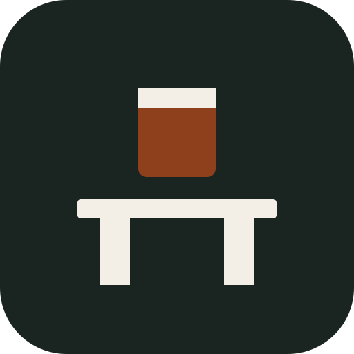
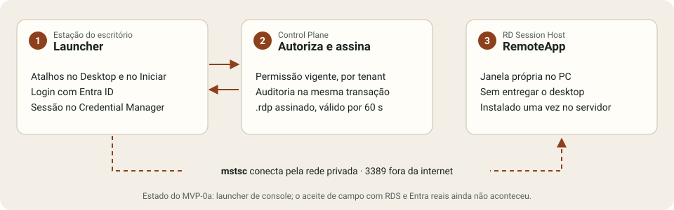

<p align="center">
  <picture>
    <source media="(prefers-color-scheme: dark)" srcset="docs/brand/mark-dark.svg">
    
  </picture>
</p>

<h1 align="center">AppBridge</h1>

<p align="center"><strong>Instale uma vez. Publique para todos.</strong></p>

<p align="center">Aplicativos Windows do servidor aparecem no PC do escritório como atalho local,<br>com janela própria, permissão central e auditoria. Sem entregar o desktop remoto.</p>

<p align="center">
  <a href="https://github.com/fredabsd-svg/appbridge/actions/workflows/control-plane.yml"></a>
  
  
</p>

<p align="center">
  <a href="#o-problema">O problema</a> ·
  <a href="#como-funciona">Como funciona</a> ·
  <a href="#segurança-e-lgpd">Segurança</a> ·
  <a href="#onde-está">Onde está</a> ·
  <a href="#para-desenvolver">Desenvolver</a> ·
  <a href="#documentação">Documentação</a>
</p>

---

## O problema

Escritórios de contabilidade trabalham em Domínio, Alterdata, Excel pesado e ERP de cliente. Esses programas não têm versão web. Instalar em cada PC espalha versão e dado. Entregar o desktop remoto é entregar um segundo computador. A nuvem de um fornecedor resolve um sistema e deixa o resto para trás.

O AppBridge trata o **aplicativo** como unidade: quem pode abrir, de onde e com que rastro. O protocolo continua sendo o RDP da Microsoft, sobre Windows Server RDS/RemoteApp. Não reimplementamos o RDP.

## Como funciona

<picture>
  <source media="(prefers-color-scheme: dark)" srcset="docs/brand/fluxo-dark.svg">
  
</picture>

| Passo | O que a pessoa vê | O que acontece por baixo |
| --- | --- | --- |
| Instala no servidor | Uma versão do sistema para o escritório inteiro. | O aplicativo vive no RD Session Host e é publicado como RemoteApp. |
| Autoriza quem abre | Permissão é decisão administrativa. Revogar não é caçar senha. | A autorização é do AppBridge, por tenant. O diretório (AD DS e Entra ID) só autentica. |
| Clica no atalho | Desktop e Menu Iniciar. Janela própria. | O Control Plane gera um `.rdp` assinado e de vida curta, e o `mstsc` abre a sessão. |
| Fica o rastro | Quem, o quê, quando, de onde. | A auditoria é gravada na mesma transação que libera o acesso. Sem auditoria, sem lançamento. |

### O que vem depois do MVP

Três recursos são o motivo de o AppBridge existir. Nenhum deles está pronto; estão no [roadmap](docs/ROADMAP.md):

- **Cofre de certificados digitais**: A1 guardado de forma central e injetado na sessão por política, com trilha de cada uso. O A3 em token USB é tratado como caso principal. Previsto para a V2.
- **Licenças por aplicativo**: uso simultâneo em tempo real e teto por app. A medição mínima foi antecipada para o MVP-1 (ADR-0006).
- **Orquestrador de atualizações**: drenar sessões, abrir janela de manutenção, tirar snapshot e fazer rollback. Previsto para a V3.

## Segurança e LGPD

| Regra | Como o código cumpre |
| --- | --- |
| A porta 3389 nunca é exposta à internet | No MVP-0, o acesso é só por rede privada com ACL (ADR-0003). RD Gateway com MFA na V2. |
| RDP sempre assinado | `rdpsign` fica atrás de `IRdpFileSigner`. A chave privada não sai do repositório de certificados da máquina (ADR-0009). |
| O tenant nunca vem do cliente | Filtro global no `DbContext`, chave estrangeira composta com `tenant_id` e `404` para recurso de outro tenant (ADR-0004, ADR-0011, ADR-0012). |
| Auditoria bloqueante | O evento de segurança entra na mesma transação que concede o acesso (ADR-0007). |
| Sessão revogável | Access token curto com `sid`, refresh opaco rotativo, detecção de replay e só hashes no banco (ADR-0020). |
| Segredo fora do repositório | Chaves e connection strings chegam por variável de ambiente ou cofre, nunca por arquivo versionado. |

O modelo de ameaças completo, no formato STRIDE e com as pendências abertas, está em [SEGURANCA.md](docs/SEGURANCA.md).

## Onde está

O design fechou em agosto de 2026. A fatia de software do **MVP-0a** compila e é testada neste repositório. **Ela ainda não é o produto aceito.** Faltam Windows Server 2025, RDS, Entra real, Connection Broker, `rdpsign` com certificado e uma estação no domínio.

| Componente | Agora |
| --- | --- |
| Control Plane | ASP.NET Core e PostgreSQL: catálogo autorizado com `ETag`, ícones, lançamento idempotente, reutilização e reconciliação de sessão, login com refresh rotativo e auditoria. |
| Launcher | Console .NET 10 que autentica, lista e abre via `mstsc`. O WinUI 3 com MSIX entra no MVP-0b (ADR-0019). |
| Agent | Ainda não existe. Entra na V2. |
| Painel admin | Ainda não existe. O MVP-0 não tem administração visual. |

| Marco | Quando | O que entrega |
| --- | --- | --- |
| M2a · MVP-0a | meados de out/2026 | Esqueleto de ponta a ponta: um usuário e um aplicativo. |
| M2b · MVP-0b | dez/2026 a jan/2027 | Uso real no escritório (dogfood). |
| M3 · Piloto | abr a jun/2027 | De 3 a 5 escritórios contábeis no serviço hospedado. |

O estado de cada dia está em [STATUS.md](docs/STATUS.md).

## Para desenvolver

Você precisa do .NET SDK 10.0.401 (fixado em `global.json`) e do PostgreSQL 18. O perfil local do Control Plane escuta só em `http://127.0.0.1:5080`.

```sh
dotnet tool restore
dotnet ef database update --project src/AppBridge.ControlPlane
dotnet run --project src/AppBridge.ControlPlane

# testes: usam o banco em ConnectionStrings__AppBridgeTest
dotnet test tests/AppBridge.ControlPlane.Tests
```

A configuração de identidade, a chave de assinatura dos tokens e o cadastro inicial estão em [Desenvolvimento e operação local](docs/operacao/desenvolvimento-control-plane.md). O Launcher só abre RemoteApps em Windows.

Commits seguem Conventional Commits em inglês. A documentação e os ADRs são escritos em português. Uma decisão relevante começa por um ADR, antes da mudança.

## Documentação

| Documento | Para quê |
| --- | --- |
| [VISAO.md](docs/VISAO.md) | Problema, público, proposta de valor e o que o produto não faz |
| [REQUISITOS.md](docs/REQUISITOS.md) | RF e RNF com ID e prioridade MoSCoW |
| [ARQUITETURA.md](docs/ARQUITETURA.md) | C4 e diagramas de sequência (login, lançamento, prelaunch, revogação) |
| [MODELO-DE-DADOS.md](docs/MODELO-DE-DADOS.md) · [API.md](docs/API.md) | Entidades multi-tenant e o contrato `/v1` |
| [SEGURANCA.md](docs/SEGURANCA.md) | Ameaças, controles e pendências |
| [ROADMAP.md](docs/ROADMAP.md) | Épicos, tarefas e critérios de aceite |
| [adr/](docs/adr) | As decisões registradas, que não se editam depois de aceitas |

## Marca

A marca é uma ponte de arco com uma janela de aplicativo sobre o tabuleiro: o sistema sai do servidor e chega ao PC. Os arquivos ficam em [`docs/brand/`](docs/brand):

- [`mark.svg`](docs/brand/mark.svg), para fundo claro, e [`mark-dark.svg`](docs/brand/mark-dark.svg), para fundo escuro.
- [`mark.png`](docs/brand/mark.png), em 512 px.
- [`social-preview.png`](docs/brand/social-preview.png), em 1280 × 640, para a prévia do repositório em *Settings → Social preview*.

As cores são tinta `#1A2420`, papel `#F3EFE6` e cobre `#8E3F1C`. A tinta sobre o papel tem contraste de 13,9:1, e o cobre sobre o papel tem 6,4:1. Os dois passam no nível AA da WCAG 2.2.
