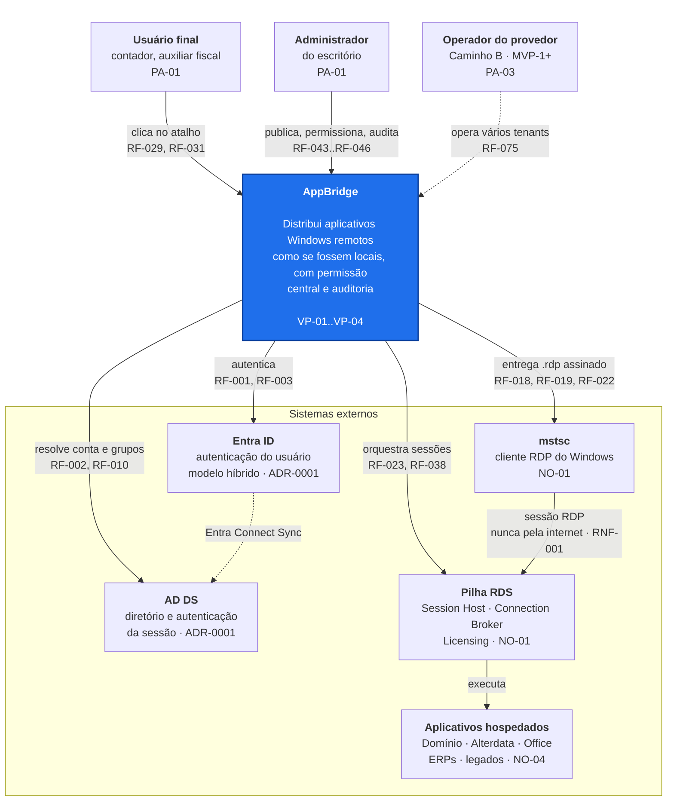
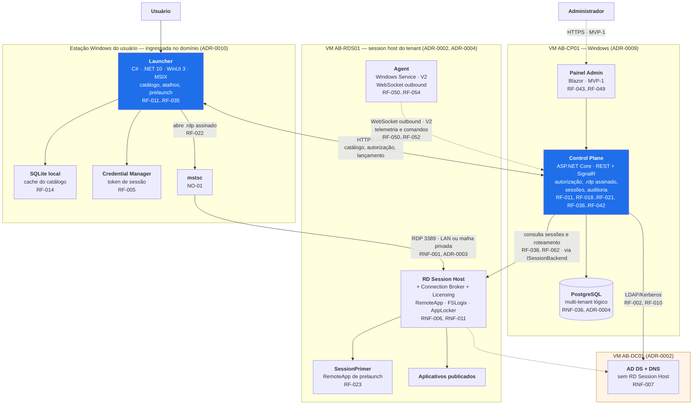
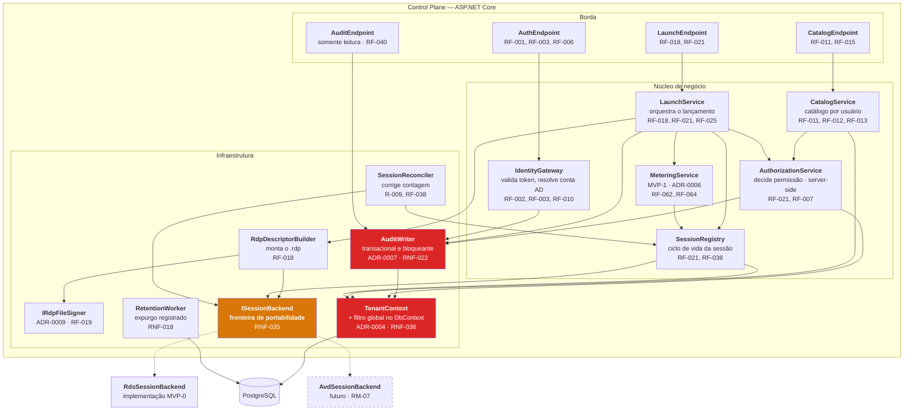
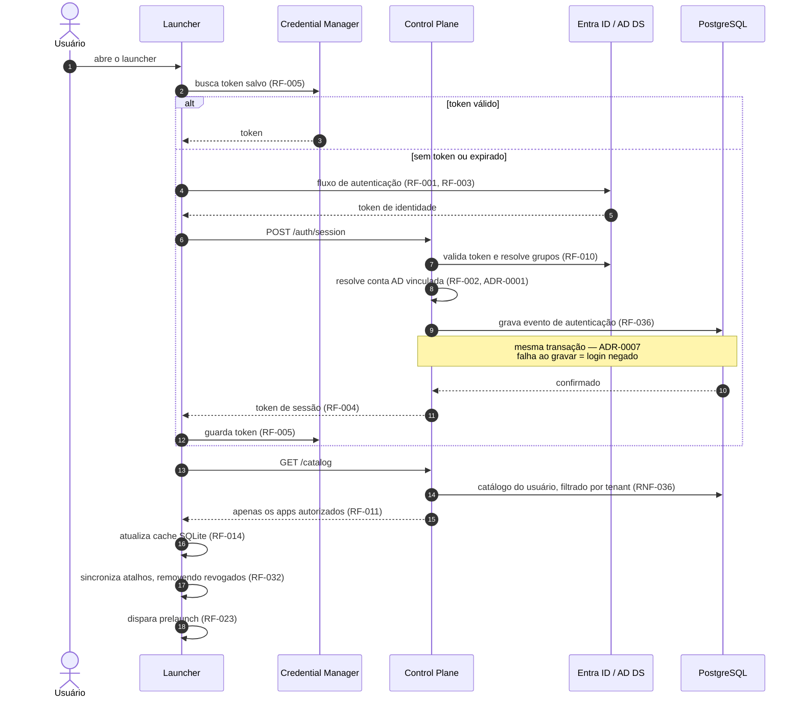
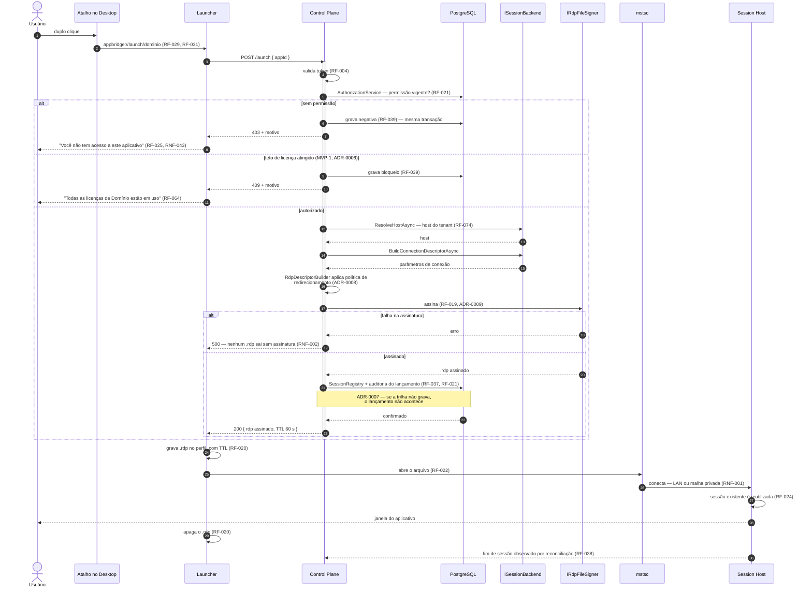
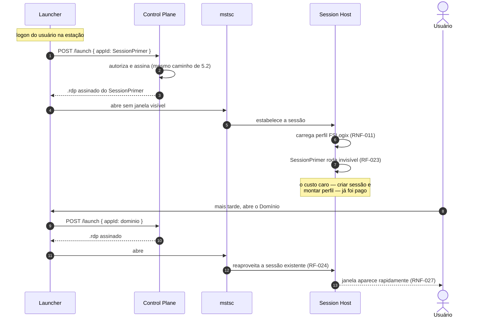
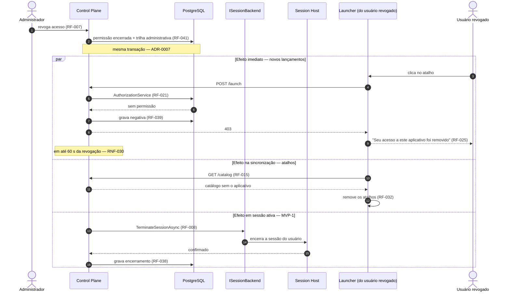

# ARQUITETURA — AppBridge
> Entregável 3 de 7 da fase de Design · Sessão S001 · 2026-08-08
> Status: **✅ aprovado por Frederico em 2026-08-08** (RP-04)
> Depende de: `VISAO.md` e `REQUISITOS.md` (aprovados), ADR-0001 a ADR-0010
> Decisões posteriores que a afetam: ADR-0011 (modelo de dados), ADR-0012 (API)

---

## 1. Como ler este documento

Modelo **C4** nos níveis 1 (Contexto), 2 (Contêineres) e 3 (Componentes), seguido dos diagramas de
sequência exigidos pela Seção 7 do prompt mestre.

- **Todo componente referencia os requisitos que justificam sua existência** (RA-04). Componente sem
  requisito é componente que não deveria existir.
- O escopo desenhado é o **MVP-0**, com os elementos de MVP-1, V2 e V3 marcados e tracejados nos
  diagramas, para que a fronteira de fase fique visível.
- Decisões já ratificadas (ADR-0001..0010) são **premissas deste documento**, não são rediscutidas.
- Premissas novas aparecem marcadas `PREMISSA:` e vão para `STATUS.md`.

---

## 2. C4 Nível 1 — Contexto do sistema



### 2.1 O que o diagrama afirma

1. **O AppBridge não fica no caminho do tráfego RDP.** Ele autoriza, gera o descritor assinado e sai
   de cena; o `mstsc` fala direto com o session host. É isso que sustenta RNF-032 (Control Plane fora
   do ar não derruba sessão em andamento) e o não-objetivo NO-01.
2. **Há duas autenticações distintas**, e confundi-las é o erro clássico: o Entra ID autentica o
   usuário *perante o AppBridge*; o AD DS autentica a conta que *abre a sessão* (ADR-0001, ADR-0010).
3. **O AppBridge nunca toca nos aplicativos hospedados** (NO-04). Ele publica, mede e orquestra ao
   redor deles.

---

## 3. C4 Nível 2 — Contêineres



### 3.1 Contêineres

| Contêiner | Tecnologia | Responsabilidade | Requisitos | Fase |
|-----------|-----------|------------------|-----------|------|
| **Launcher** | .NET 10 · WinUI 3 · MSIX (ADR-0005) | Catálogo, atalhos, protocolo, prelaunch, lançamento, latência | RF-011..RF-035 | MVP-0 |
| **SQLite local** | SQLite | Cache do catálogo e estado local do launcher | RF-014 | MVP-0 |
| **Control Plane** | ASP.NET Core | Autorização, geração e assinatura do `.rdp`, registro de sessões, auditoria, metering | RF-001..RF-042, RF-062..RF-066 | MVP-0 |
| **PostgreSQL** | PostgreSQL | Persistência multi-tenant e trilha de auditoria | RNF-036, RNF-019 | MVP-0 |
| **Painel Admin** | Blazor | Publicação, permissões, sessões, logs, políticas | RF-043..RF-049 | MVP-1 |
| **RD Session Host** | Windows Server 2025 RDS | Executa os aplicativos publicados | NO-01, RNF-006, RNF-011 | MVP-0 |
| **SessionPrimer** | RemoteApp mínimo | Mantém a sessão viva para o prelaunch | RF-023 | MVP-0 |
| **AD DS** | Windows Server 2025 | Diretório e autenticação da sessão | ADR-0001, RNF-007 | MVP-0 |
| **Agent** | .NET Windows Service | Telemetria e canal de comando | RF-050..RF-054 | V2 |

### 3.2 Portas e fluxos — o que atravessa o quê

| Origem | Destino | Protocolo/porta | Alcance | Justificativa |
|--------|---------|-----------------|---------|---------------|
| Launcher | Control Plane | HTTPS 443 | LAN ou malha privada | RNF-003 |
| `mstsc` | Session Host | RDP 3389 | **LAN ou malha privada apenas** | RNF-001, ADR-0003 |
| Control Plane | AD DS | LDAP/Kerberos | LAN interna | RF-002 |
| Control Plane | Connection Broker | canal administrativo do RDS | LAN interna | RF-038, atrás de `ISessionBackend` |
| Control Plane | PostgreSQL | 5432 | **local à VM** | RNF-012 |
| Agent (V2) | Control Plane | WSS 443 **outbound** | — | RF-050 |
| Internet | qualquer um | **nada** | — | RNF-001, RNF-009, CS-04 |

> **Não há linha de entrada vinda da internet neste diagrama.** Essa ausência é o requisito RNF-001
> desenhado, e é verificável por varredura externa (CS-04).

---

## 4. C4 Nível 3 — Componentes do Control Plane



### 4.1 Os três componentes que carregam as decisões

Estes três não são "mais um serviço": cada um materializa uma decisão que, se for contornada em
qualquer ponto do código, deixa de existir.

| Componente | Decisão que materializa | O que acontece se for contornado |
|------------|------------------------|----------------------------------|
| **`TenantContext` + filtro global** | ADR-0004 | Vazamento de dados entre escritórios contábeis concorrentes. É o pior incidente possível deste produto. |
| **`AuditWriter`** | ADR-0007 | Acesso concedido sem registro — exatamente o que a trilha existe para impedir. Por isso ele participa da **mesma transação** que concede o acesso, e não de uma fila. |
| **`ISessionBackend`** | RNF-035, RM-07 | O Control Plane passa a conhecer detalhes do RDS, e a troca por AVD vira reescrita em vez de nova implementação. |

### 4.2 `ISessionBackend` — a fronteira de portabilidade

Toda interação com a tecnologia de sessão passa por aqui. **Nenhuma regra de negócio importa tipo do
RDS.**

| Operação | Uso | Fase |
|----------|-----|------|
| `ResolveHostAsync(tenant, user, app)` | Escolhe o host do tenant que atenderá o lançamento | MVP-0 · RF-074 |
| `BuildConnectionDescriptorAsync(...)` | Produz os parâmetros de conexão que viram o `.rdp` | MVP-0 · RF-018 |
| `ListActiveSessionsAsync(tenant)` | Fonte de verdade para reconciliação e metering | MVP-0 · RF-038, RF-062 |
| `TerminateSessionAsync(sessionId)` | Encerramento forçado e revogação | MVP-1 · RF-008, RF-045 |
| `PublishApplicationAsync(...)` | Publicação de aplicativo | V2 · RF-052 |
| `GetHostHealthAsync(...)` | Estado do host | V2 · RF-047, RF-054 |

`RdsSessionBackend` implementa via a superfície administrativa do RDS. `AvdSessionBackend` é o degrau
previsto para RM-07 — **não é construído agora**, mas a interface existe desde o MVP-0 justamente para
que ele seja possível sem reescrita.

### 4.3 Componentes do Launcher

| Componente | Responsabilidade | Requisitos |
|------------|------------------|-----------|
| `ProtocolHandler` | Trata `appbridge://launch/<app>` | RF-029 |
| `ApiClient` | Fala com o Control Plane; renova token | RF-004 |
| `CredentialStore` | Windows Credential Manager. **Nunca senha de domínio** (ADR-0010) | RF-005 |
| `CatalogSync` | Sincroniza catálogo e mantém o cache SQLite | RF-014, RF-015 |
| `ShortcutManager` | Cria e **remove** atalhos no Desktop e Menu Iniciar | RF-030..RF-032 |
| `LaunchCoordinator` | Pede autorização, recebe `.rdp`, grava com TTL, chama `mstsc`, apaga | RF-018, RF-020, RF-022 |
| `PrelaunchService` | Dispara o SessionPrimer e mantém a sessão pronta | RF-023 |
| `LatencyProbe` | Indicador de latência | RF-026 |
| `DiagnosticsCollector` | Coleta diagnóstico sem o usuário navegar em pastas (MVP-1) | RNF-041 |

---

## 5. Diagramas de sequência

### 5.1 Login



> **O passo 3 é decisão de arquitetura, não detalhe:** a senha de domínio nunca passa pelo Control
> Plane (ADR-0010). Ele emite autorização; a credencial é assunto entre a estação e o Windows.

### 5.2 Lançamento de aplicativo — o caminho crítico



**Três propriedades que este diagrama garante:**

1. **Nada é decidido no cliente.** O launcher não escolhe host, não monta `.rdp`, não avalia
   permissão. Ele pede e recebe (RF-021).
2. **Não existe caminho que produza `.rdp` sem assinatura** (RNF-002) nem acesso sem registro
   (ADR-0007). Os dois pontos de falha levam a erro, não a degradação silenciosa.
3. **O Control Plane sai do caminho** assim que o `mstsc` conecta. Daí em diante, derrubá-lo não
   afeta o trabalho (RNF-032).

### 5.3 Prelaunch



> **Ponto frágil, declarado:** quando o último RemoteApp fecha, o RDS encerra a sessão após um tempo
> configurado. O SessionPrimer só cumpre seu papel se permanecer em execução e se o tempo de logoff de
> sessão RemoteApp estiver ajustado por GPO. `PREMISSA:` (PRE-22) essa combinação sustenta o prelaunch
> por uma jornada de trabalho — **precisa ser medida no dogfood**, porque é dela que depende o número
> de RNF-027 (≤ 5 s), que por sua vez é a evidência de VP-02.

### 5.4 Publicação de aplicativo

```mermaid
sequenceDiagram
    autonumber
    actor A as Administrador
    participant ADM as Painel Admin (MVP-1)
    participant CP as Control Plane
    participant DB as PostgreSQL
    participant AG as Agent (V2)
    participant SH as Session Host
    participant L as Launcher

    rect rgb(255, 244, 230)
        Note over A,DB: MVP-0 — sem painel: seed em JSON/tabela (RF-012)<br/>e publicação manual do RemoteApp no host
    end

    A->>ADM: publica aplicativo (RF-043)
    ADM->>CP: POST /apps
    CP->>DB: grava app + trilha administrativa (RF-041, RNF-017)
    Note over CP,DB: quem publicou, quando, antes/depois — ADR-0007

    alt V2 — com Agent
        CP->>AG: comando de publicação (RF-052)
        AG->>SH: registra o RemoteApp
        AG->>SH: ajusta AppLocker/WDAC (RNF-006)
        AG-->>CP: resultado
        CP->>DB: grava resultado
    else MVP-1 — sem Agent
        Note over CP,SH: publicação no host é manual;<br/>o painel só governa catálogo e permissão
    end

    A->>ADM: concede acesso ao grupo (RF-044, RF-010)
    ADM->>CP: POST /apps/{id}/permissions
    CP->>DB: grava permissão + trilha (RF-041)
    L->>CP: próxima sincronização (RF-015)
    CP-->>L: catálogo atualizado
    L->>L: cria os novos atalhos (RF-030)
```

> **Assimetria proposital:** no MVP-1 o painel governa **catálogo e permissão**, mas quem instala o
> aplicativo no host ainda é uma pessoa. A publicação ponta a ponta só existe com o Agent (V2). Isso
> precisa estar claro no material comercial — vender "publique pelo painel" antes da V2 seria promessa
> que o produto não cumpre.

### 5.5 Revogação de acesso



> **Lacuna do MVP-0, declarada:** sem `TerminateSessionAsync` implementado (RF-008 é MVP-1), o usuário
> revogado **continua trabalhando na sessão já aberta** até que ela termine. Novos lançamentos são
> negados em até 60 s, mas o que está aberto permanece. Para uma demissão, a resposta do MVP-0 é
> desabilitar a conta no AD **e** encerrar a sessão manualmente no host. Isso precisa constar no
> roteiro operacional — é o tipo de lacuna que só aparece no pior momento possível.

---

## 6. Modo degradado e tratamento de falhas

Como o sistema se comporta quando cada peça cai. A coluna que importa é a última.

| Falha | Sessões abertas | Novos lançamentos | Requisito |
|-------|-----------------|-------------------|-----------|
| **Control Plane fora do ar** | Continuam normalmente | Bloqueados; launcher exibe estado offline com catálogo em cache | RNF-032, RF-014 |
| **PostgreSQL fora do ar** | Continuam | Bloqueados — sem banco não há autorização nem trilha | ADR-0007, RNF-032 |
| **Disco cheio no banco** | Continuam | **Bloqueados** — consequência intencional da auditoria bloqueante | ADR-0007, R-012 |
| **`rdpsign` falha** | Continuam | Bloqueados; nenhum `.rdp` sai sem assinatura | RNF-002, ADR-0009 |
| **AD DS fora do ar** | Continuam até expirar o ticket | Bloqueados; logon nas estações também é afetado | ADR-0010 |
| **Session host fora do ar** | Perdidas | Bloqueados para aquele host | RF-025 |
| **Rede do usuário cai** | Reconecta (MVP-1) | — | RF-027 |
| **Contagem de licença inconsistente** | Continuam | Podem ser bloqueados indevidamente | **R-009** — mitigação: `SessionReconciler` |

**Leitura honesta desta tabela:** o Control Plane não está no caminho do trabalho em andamento, mas
**está no caminho de começar a trabalhar**. Um escritório contábil às 8h da manhã, com todo mundo
abrindo o Domínio ao mesmo tempo, é exatamente o momento em que ele não pode estar fora do ar. Isso
torna RNF-033 (backup) e RNF-040 (health check e alerta de disco) requisitos operacionais de verdade,
não formalidades.

---

## 7. Rastreabilidade — componente → requisito

Cobertura verificada em ambos os sentidos: nenhum componente sem requisito, nenhum requisito de MVP-0
sem componente.

| Componente | Requisitos atendidos | ADR |
|------------|---------------------|-----|
| Launcher · `ProtocolHandler` | RF-029, RF-031 | — |
| Launcher · `CatalogSync` + SQLite | RF-011, RF-014, RF-015 | ADR-0005 |
| Launcher · `ShortcutManager` | RF-030, RF-031, RF-032 | ADR-0005, ADR-0010 |
| Launcher · `LaunchCoordinator` | RF-018, RF-020, RF-022, RF-025 | — |
| Launcher · `PrelaunchService` + SessionPrimer | RF-023, RF-024, RNF-027 | — |
| Launcher · `CredentialStore` | RF-005 | ADR-0010 |
| Launcher · `LatencyProbe` | RF-026 | — |
| CP · `IdentityGateway` | RF-001..RF-003, RF-010 | ADR-0001 |
| CP · `AuthorizationService` | RF-007, RF-021, RF-039 | ADR-0004 |
| CP · `CatalogService` | RF-011, RF-012, RF-013 | — |
| CP · `LaunchService` | RF-018..RF-021, RF-025 | ADR-0008 |
| CP · `RdpDescriptorBuilder` | RF-018, RNF-014 | ADR-0008 |
| CP · `IRdpFileSigner` | RF-019, RNF-002, RNF-008 | **ADR-0009** |
| CP · `ISessionBackend` | RF-038, RF-074, RNF-035 | ADR-0004 |
| CP · `SessionRegistry` + `SessionReconciler` | RF-021, RF-038 | ADR-0006 |
| CP · `MeteringService` (MVP-1) | RF-062..RF-064 | **ADR-0006** |
| CP · `AuditWriter` | RF-036..RF-042, RNF-015, RNF-019, RNF-022 | **ADR-0007** |
| CP · `TenantContext` + filtro global | RF-073..RF-075, RNF-036 | **ADR-0004** |
| CP · `RetentionWorker` | RNF-018 | ADR-0007 |
| Infra · VM AB-DC01 separada | RNF-007 | **ADR-0002** |
| Infra · GPO de redirecionamento | RNF-014 | **ADR-0008** |
| Infra · GPO de delegação de credenciais | RNF-042, RNF-005 | **ADR-0010** |
| Infra · malha privada com ACL | RNF-001, RNF-009 | **ADR-0003** |
| Infra · FSLogix, AppLocker/WDAC | RNF-006, RNF-011 | — |
| Agent (V2) | RF-050..RF-054 | — |
| Painel Admin (MVP-1) | RF-043..RF-049 | — |

---

## 8. Premissas introduzidas por este documento (RP-05)

| ID | Premissa | Onde | Impacto se errada |
|----|----------|------|-------------------|
| **PRE-21** | Todas as estações rodam edição do Windows que permite ingresso em domínio (Home não permite) | ADR-0010 | Máquinas Home vão para o caminho degradado, com senha a cada lançamento — RNF-042 não se cumpre nelas |
| **PRE-22** | SessionPrimer em execução, com o tempo de logoff de sessão RemoteApp ajustado por GPO, sustenta o prelaunch por uma jornada | §5.3 | É a base de RNF-027 (≤ 5 s) e, portanto, da evidência de VP-02. Precisa de medição no dogfood |
| **PRE-23** | A superfície administrativa do RDS (Connection Broker) permite consultar e encerrar sessões com a confiabilidade exigida por RF-038 e RF-008 | §4.2 | Sem isso, o metering (ADR-0006) e a revogação em sessão ativa perdem a fonte de verdade até o Agent chegar na V2 |

---

## 9. Riscos arquiteturais

Numeração contínua com o registro de riscos de `STATUS.md`. (O prefixo `RA-` é reservado às Regras de
Auditoria do prompt mestre e não é usado para riscos.)

| ID | Risco | Onde nasce |
|----|-------|-----------|
| **R-013** | `rdpsign` como processo por lançamento pode virar gargalo sob carga e prende o Control Plane ao Windows | ADR-0009 |
| **R-014** | Sem `TerminateSessionAsync` no MVP-0, a revogação não alcança sessão aberta — a demissão exige procedimento manual no host | §5.5, RF-008 |
| **R-015** | O prelaunch depende de um comportamento de tempo de logoff do RDS que ainda não foi medido; dele depende o número de RNF-027 | PRE-22 |
| **R-016** | O Control Plane não bloqueia o trabalho em andamento, mas bloqueia começar a trabalhar — e o pico de início é às 8h | §6 |
| **R-017** | `SessionReconciler` é a única defesa contra contagem inflada de licença antes do Agent chegar | R-009, ADR-0006 |
| **R-018** | `AvdSessionBackend` nunca foi implementado; a portabilidade prometida por RNF-035 é hipótese até existir uma segunda implementação que a prove | §4.2, RM-07 |
