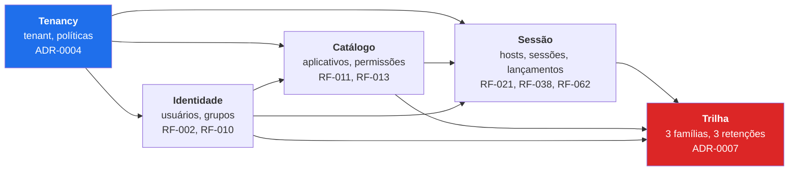
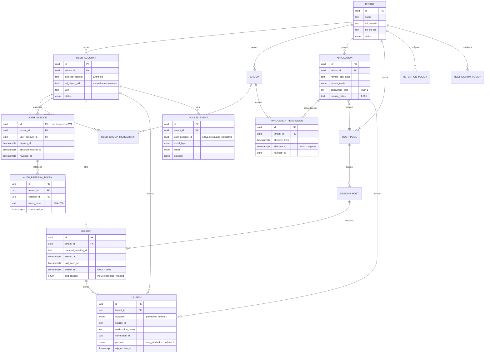
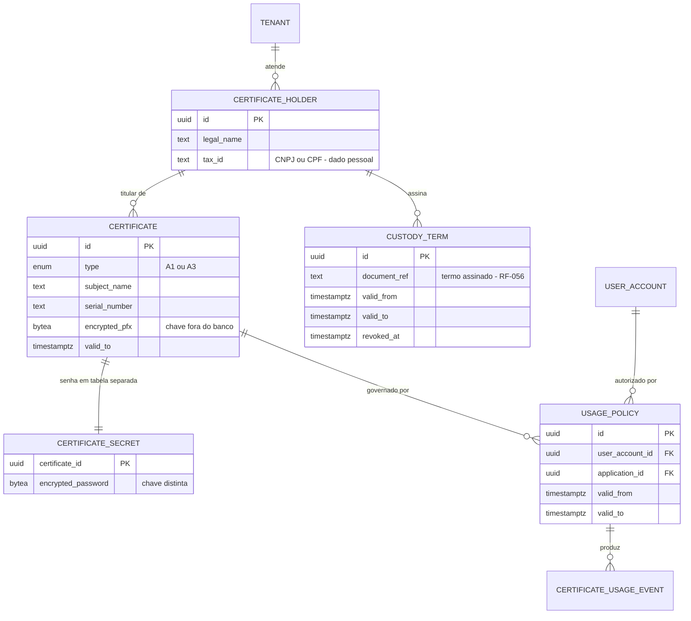

# MODELO DE DADOS — AppBridge (Control Plane)
> Entregável 4 de 7 da fase de Design · Sessão S001 · 2026-08-08
> Status: **✅ aprovado por Frederico em 2026-08-08** (RP-04)
> Depende de: `ARQUITETURA.md`, ADR-0004 (isolamento), ADR-0007 (auditoria e retenção), ADR-0011 (convenções)
> Emendado por **ADR-0016** (coluna `purpose` em `launch`, §7.1) e **ADR-0018** (`launch_idempotency`, §7.2)

---

## 1. Como ler este documento

- **Convenções de chave, tempo, exclusão e integridade estão em ADR-0011** e não se repetem entidade a
  entidade. Toda tabela as segue.
- Cada entidade traz **fase** (MVP-0 / MVP-1 / V2 / V3) e os **requisitos que a justificam** (RA-04).
  Entidade sem requisito não existe.
- **Multi-tenant desde a primeira migração** (§2.5 do prompt mestre, ADR-0004): toda tabela de dados de
  tenant tem `tenant_id NOT NULL` e participa da FK composta de ADR-0011 §4.
- Colunas de auditoria (`created_at`, `created_by`, `updated_at`, `updated_by`, `row_version`) existem
  em **toda tabela mutável**. `deleted_at`/`deleted_by` existem nas tabelas operacionais com exclusão
  lógica; `application_permission` é a exceção porque usa vigência temporal e não aceita exclusão.
  Esses campos são omitidos das listagens abaixo para não poluir. Tabelas de trilha carregam apenas
  `created_at`/`created_by`, pelo motivo declarado em ADR-0011 §5.

---

## 2. Visão geral — os cinco domínios

**A decisão estruturante deste modelo:** a trilha não é *uma* tabela. São **três famílias, uma por
categoria de retenção do ADR-0007** — acesso (12 meses), administrativa (24 meses) e uso de
certificado (60 meses). Separá-las por tabela faz o expurgo ser um `DELETE` por tabela com um corte de
data, em vez de uma varredura condicional numa tabela gigante e heterogênea.

---

## 3. Domínio Tenancy

### 3.1 `tenant` — MVP-0

A única tabela **sem** `tenant_id`: ela é o tenant.

| Coluna | Tipo | Notas |
|--------|------|-------|
| `id` | uuid v7 PK | |
| `name` | text | Razão social ou nome do escritório |
| `slug` | text UNIQUE | Identificador legível, usado em rotas administrativas |
| `status` | enum | `active`, `suspended`, `terminated` |
| `ad_domain` | text | Domínio AD DS que atende o tenant (ADR-0001) |
| `ad_ou_dn` | text | OU dedicada do tenant (ADR-0004) |

**Requisitos:** RF-073, RF-076 · **ADR:** 0004

### 3.2 `retention_policy` — MVP-0

Materializa a tabela de prazos do ADR-0007. Uma linha por tenant × categoria.

| Coluna | Tipo | Notas |
|--------|------|-------|
| `id` | uuid v7 PK | |
| `tenant_id` | uuid FK | |
| `category` | enum | `access`, `administrative`, `certificate_usage` |
| `retention_months` | int | Validado contra o mínimo da categoria |

`CHECK` por categoria impede configurar abaixo do mínimo — **o mínimo é regra de banco, não de tela**,
porque a proteção existe justamente contra instrução equivocada de cliente. Conforme ADR-0007, os
limites são: `access` entre 6 e 60 meses, `administrative` entre 12 e 60 meses e
`certificate_usage` a partir de 60 meses, sem máximo. Os padrões continuam 12/24/60 meses.
`UNIQUE (tenant_id, category)`.

**Requisitos:** RNF-018 · **ADR:** 0007

### 3.3 `redirection_policy` — MVP-0

Política base de ADR-0008, por tenant, com sobreposição opcional por aplicativo.

| Coluna | Tipo | Padrão (ADR-0008) |
|--------|------|-------------------|
| `tenant_id` | uuid FK | |
| `application_id` | uuid FK NULL | `NULL` = política do tenant |
| `allow_printer` | bool | `true` |
| `allow_smartcard` | bool | `true` |
| `allow_clipboard` | bool | `true` |
| `allow_audio_out` | bool | `true` |
| `allow_drives` | bool | **`false`** |
| `allow_serial_ports` | bool | **`false`** |
| `allow_audio_in` | bool | **`false`** |
| `allow_other_usb` | bool | **`false`** |
| `exception_reason` | text NULL | **Obrigatório** quando difere do padrão do tenant |

A coluna `exception_reason` é o que impede que exceções virem folclore: exige justificativa quando
qualquer valor diverge da política do tenant (ADR-0008, condição 2). Essa comparação envolve duas
linhas e não pode ser expressa por um `CHECK` PostgreSQL simples; o `RedirectionPolicyResolver`
compara as duas políticas e exige justificativa quando a configuração do aplicativo amplia a base
(T-501, resolvida em S013).

**Requisitos:** RNF-014, RF-048 · **ADR:** 0008

### 3.4 `signing_certificate` — MVP-0

Metadados do certificado de assinatura do `.rdp`. **A chave privada não está aqui** — ela é não
exportável no repositório da máquina (ADR-0009). Esta tabela existe para tornar a rotação e o
vencimento visíveis, não para guardar segredo.

| Coluna | Tipo | Notas |
|--------|------|-------|
| `id` | uuid v7 PK | |
| `tenant_id` | uuid FK | Certificado de assinatura pertence a um tenant |
| `thumbprint` | text UNIQUE | Distribuída às estações por GPO |
| `subject`, `issuer` | text | |
| `valid_from`, `valid_to` | timestamptz | Alerta de vencimento |
| `status` | enum | `active`, `superseded`, `revoked` |
| `activated_at`, `retired_at` | timestamptz | Histórico de rotação |

**Requisitos:** RNF-008 · **ADR:** 0009

---

## 4. Domínio Identidade

### 4.1 `user_account` — MVP-0

O **vínculo entre as duas autenticações** do ADR-0001 mora aqui: `external_subject` identifica quem
autentica no Control Plane; `ad_object_sid` identifica a conta que abre a sessão.

| Coluna | Tipo | Notas |
|--------|------|-------|
| `id` | uuid v7 PK | |
| `tenant_id` | uuid FK | |
| `external_subject` | text | Identificador estável do provedor (Entra `oid`) |
| `upn` | text | Precisa ser roteável para o híbrido funcionar (ADR-0001, riscos) |
| `ad_object_sid` | text | **SID**, não `sAMAccountName`: sobrevive a renomeação |
| `display_name` | text | Dado pessoal — ver §9 |
| `email` | text | Dado pessoal — ver §9 |
| `status` | enum | `active`, `disabled` |
| `last_login_at` | timestamptz | |

`UNIQUE (tenant_id, external_subject)` e `UNIQUE (tenant_id, ad_object_sid)`.

> **Por que o SID e não o login:** renomear uma usuária no AD (troca de sobrenome, correção de grafia)
> muda o `sAMAccountName` e o UPN, mas não o SID. Chavear pelo login faria a trilha histórica apontar
> para uma pessoa que "deixou de existir" — inaceitável numa trilha de auditoria.

**Requisitos:** RF-001, RF-002, RF-003, RF-005 · **ADR:** 0001

### 4.2 `auth_session` — MVP-0b · ADR-0020

Uma linha representa a sessão de um launcher. `id` é o `sid` embutido no access JWT e vincula todos
os refresh tokens rotacionados daquela sessão. A consulta por esta linha ocorre em cada chamada
autenticada para que logout e replay invalidem o JWT imediatamente.

| Coluna | Tipo | Notas |
|--------|------|-------|
| `id` | uuid v7 PK | Claim `sid` do access token |
| `tenant_id` | uuid FK | FK composta para usuário e refresh tokens |
| `user_account_id` | uuid | FK composta `(tenant_id, user_account_id)` |
| `workstation_name` | varchar(128) | Estação informada no login; usada na trilha de refresh/logout |
| `last_used_at` | timestamptz | Último refresh confirmado |
| `expires_at` | timestamptz | Expiração por inatividade, limitada por `absolute_expires_at` |
| `absolute_expires_at` | timestamptz | Máximo de vida da sessão (30 dias por padrão) |
| `revoked_at`, `revocation_reason` | timestamptz, text NULL | `logout`, `refresh_replay`, `account_disabled` ou `tenant_suspended` |

A entidade também recebe os campos mutáveis comuns (`created_at/by`, `updated_at/by`, `row_version`,
`deleted_at/by`). Índice `(tenant_id, user_account_id, revoked_at)`. A tarefa de manutenção elimina
sessões vencidas/revogadas e seus refresh tokens após 30 dias de retenção técnica.

### 4.3 `auth_refresh_token` — MVP-0b · ADR-0020

Cada rotação acrescenta um registro. O access token não fica nesta tabela e o valor bruto do refresh
token nunca é gravado: `token_hash` é SHA-256 hexadecimal do valor completo. O hash consumido é
mantido enquanto a sessão puder estar ativa para detectar replay.

| Coluna | Tipo | Notas |
|--------|------|-------|
| `id` | uuid v7 PK | |
| `tenant_id` | uuid FK | |
| `session_id` | uuid | FK composta `(tenant_id, session_id)` com exclusão em cascata |
| `token_hash` | char(64) | SHA-256 hexadecimal; único por tenant |
| `expires_at` | timestamptz | Expiração ociosa vigente quando este token foi emitido |
| `consumed_at` | timestamptz NULL | Preenchido no refresh que emite o próximo token |

Inclui ainda os campos de auditoria mutáveis comuns. Índices `UNIQUE (tenant_id, token_hash)` e
`(tenant_id, session_id)`.

**Requisitos:** RF-004..RF-006, RNF-004, RNF-036 · **ADR:** 0020

### 4.4 `group` e `user_group_membership` — MVP-0

Permissão é **sempre por grupo** (RF-010). O grupo pode espelhar um grupo de diretório ou ser local
do AppBridge.

`group`: `tenant_id`, `name`, `source` (`directory` | `local`), `external_group_id` (nulo se local).

`user_group_membership`: `tenant_id`, `user_account_id`, `group_id`, `source`, `synced_at`.
Para grupos de diretório, a tabela é **cache** — a fonte da verdade é o diretório, reconsultado no
login (RF-010). O `synced_at` existe para que uma decisão de autorização nunca se apoie em cache velho
sem que isso seja detectável.

**Requisitos:** RF-010, RF-044 · **ADR:** 0001

---

## 5. Domínio Catálogo

### 5.1 `application` — MVP-0

| Coluna | Tipo | Notas |
|--------|------|-------|
| `id` | uuid v7 PK | |
| `tenant_id` | uuid FK | |
| `display_name`, `description` | text | RF-013 |
| `icon_ref` | text | Referência ao ícone; binário fora da tabela |
| `remote_app_alias` | text | Alias do RemoteApp no host |
| `host_pool_id` | uuid FK | Pool do tenant (ADR-0004) |
| `launch_mode` | enum | `remote_app` \| `confined_desktop` (RF-028) |
| `status` | enum | `draft`, `published`, `retired` |
| `concurrent_limit` | int NULL | **MVP-1** — teto de licença; `NULL` = sem teto (RF-063) |
| `license_notes` | text NULL | Licença **declarada pelo cliente** (ADR-0014); alimenta T-001 |

`UNIQUE (tenant_id, remote_app_alias, host_pool_id)`.

> `license_notes` existe por um motivo específico: por **ADR-0014**, a titularidade e a conformidade
> da licença são do cliente, que as declara. Sem um lugar no modelo para registrar essa declaração por
> aplicativo, a informação viveria numa planilha e desapareceria — e é ela que sustenta o portão G-01
> e alimenta o teto de metering de RF-063.

**Requisitos:** RF-011, RF-012, RF-013, RF-028, RF-063 · **ADR:** 0006

### 5.2 `application_permission` — MVP-0

**Não tem exclusão** — tem vigência (ADR-0011 §3). Revogar é fechar `effective_to`.

| Coluna | Tipo | Notas |
|--------|------|-------|
| `id` | uuid v7 PK | |
| `tenant_id` | uuid FK | |
| `application_id` | uuid | FK composta `(tenant_id, application_id)` |
| `group_id` | uuid | FK composta `(tenant_id, group_id)` |
| `effective_from` | timestamptz | |
| `effective_to` | timestamptz NULL | `NULL` = vigente |
| `granted_by`, `revoked_by` | uuid FK | |
| `revocation_reason` | text NULL | |

Índice parcial `ix_permission_active ON (tenant_id, application_id, group_id) WHERE effective_to IS NULL`
— é o índice do caminho crítico de RF-021, consultado a cada lançamento.

> **RNF-030 (revogação propaga em 60 s) é consequência direta deste desenho:** como a autorização
> consulta a vigência a cada lançamento, a revogação vale no lançamento seguinte. Os 60 s são o
> intervalo de sincronização do catálogo no launcher, não latência de propagação no servidor.

**Requisitos:** RF-007, RF-010, RF-021, RF-044 · **ADR:** 0004

---

## 6. Domínio Sessão

### 6.1 `host_pool` e `session_host` — MVP-0

`host_pool`: `tenant_id`, `name`, `backend_type` (`rds` | `avd`).

> A coluna `backend_type` é a expressão em dados da fronteira `ISessionBackend` (RNF-035). Ela existe
> vazia de utilidade hoje — só há `rds`. Está aqui porque, se aparecer depois, a migração terá de
> classificar retroativamente pools existentes, adivinhando.

`session_host`: `tenant_id`, `host_pool_id`, `fqdn`, `status` (`online`/`draining`/`offline`),
`last_heartbeat_at` (V2), `max_sessions`.

O estado `draining` já existe no MVP-0 embora o orquestrador seja V3 (RF-068): drenar um host é
necessário para qualquer manutenção, inclusive manual, e o custo de prever o estado agora é uma linha
de enum.

**Requisitos:** RF-074, RF-047, RF-054, RF-068 · **ADR:** 0002, 0004

### 6.2 `session` — MVP-0

Registro do ciclo de vida da sessão RDS. É a **fonte da contagem de licenças** (ADR-0006) e, por
consequência, o lugar onde o risco R-009 se materializa.

| Coluna | Tipo | Notas |
|--------|------|-------|
| `id` | uuid v7 PK | |
| `tenant_id` | uuid FK | |
| `user_account_id` | uuid | FK composta |
| `session_host_id` | uuid | FK composta |
| `backend_session_id` | text NULL | Identificador no RDS — a ponte com `ISessionBackend`. `NULL` = vínculo pendente: registrada no lançamento, ainda não encontrada no Connection Broker (ADR-0021) |
| `started_at` | timestamptz | |
| `last_seen_at` | timestamptz | Atualizado pela reconciliação; numa sessão pendente, também pelo lançamento que a reutiliza (ADR-0021) |
| `ended_at` | timestamptz NULL | `NULL` = ativa |
| `end_reason` | enum NULL | `logoff`, `disconnect_timeout`, `terminated_by_admin`, `revoked`, **`reconciled_missing`**, `stale_expired` |
| `source_ip`, `workstation_name` | text | Compõem o "de onde" de RNF-015 |

Índice parcial `ix_session_active ON (tenant_id, session_host_id) WHERE ended_at IS NULL`.

> **`reconciled_missing` e `stale_expired` são as duas defesas contra R-009.** A primeira marca sessões
> que o Connection Broker não lista mais — encerramento que o AppBridge não observou. A segunda fecha
> sessões sem sinal de vida além do limite. Sem elas, o contador de licenças **infla monotonicamente**
> e o produto passa a bloquear trabalho legítimo (RF-064), que é o pior modo de falha do metering.

A linha nasce no lançamento concedido, na mesma transação do `launch` (ADR-0021). Sessão pendente fora
da janela `SessionRegistry:PendingBindingMinutes` deixa de contar para reutilização e capacidade, mas
continua aberta até a reconciliação fechá-la. A reconciliação (ADR-0022) vincula pelo SID do usuário
(`user_account.ad_object_sid`) e grava `session_started`/`session_ended` em `access_event`, com `payload`
de `sessionId`, `sessionHostId`, `endReason` e `durationSeconds`.

**Requisitos:** RF-021, RF-024, RF-038, RF-062, RF-008 · **ADR:** 0006, 0021

### 6.3 `agent_registration` e `host_telemetry` — V2

`agent_registration`: `session_host_id`, `credential_id` (referência ao segredo, **nunca o segredo**),
`enrolled_at`, `enrolled_by`, `revoked_at`, `last_heartbeat_at`. Credencial por host, revogável
individualmente (RF-053).

`host_telemetry`: série temporal de `cpu_percent`, `memory_percent`, `disk_percent`, `session_count`.
**Não é trilha de auditoria** — é dado operacional, com retenção curta própria (`PREMISSA:` PRE-24, 90
dias) e sem as garantias de imutabilidade de RNF-019. Confundir as duas coisas encheria o banco de
telemetria retida por 12 meses sem motivo.

**Requisitos:** RF-050, RF-051, RF-053, RF-054

---

## 7. Domínio Trilha — três famílias, três retenções

### 7.1 `launch` — MVP-0 · retenção `access` (12 meses)

**Esta tabela é a trilha do lançamento** (RF-037), não um registro operacional que a acompanha.
Decisão consciente: um evento genérico com carga em JSON tornaria as consultas de metering e de
correlação com sessão desnecessariamente difíceis, num caminho que é crítico e frequente.

| Coluna | Tipo | Notas |
|--------|------|-------|
| `id` | uuid v7 PK | |
| `tenant_id` | uuid FK | |
| `user_account_id`, `application_id` | uuid | FK compostas |
| `session_id` | uuid NULL | Preenchido quando a sessão é criada ou reutilizada |
| `purpose` | enum | **`user_initiated` \| `prelaunch`** — espelha o campo de `POST /v1/launches` (ADR-0016, Gap 1) |
| `requested_at` | timestamptz | |
| `outcome` | enum | `granted`, `denied_permission`, `denied_quota`, `denied_host_unavailable`, `error_signing`, `error_internal` |
| `denial_reason` | text NULL | |
| `source_ip`, `workstation_name` | text | "de onde" (RNF-015) |
| `rdp_expires_at` | timestamptz | TTL de 60 s (RF-020, PRE-07) |
| `correlation_id` | uuid | Amarra launcher → Control Plane → host (RNF-039) |

> **`purpose` não é metadado decorativo.** Sem ele, a contagem de RF-062 somaria prelaunchs como uso
> real: dez pessoas com um prelaunch por dia inflariam o contador de um aplicativo em dez usos/dia que
> nunca existiram, e o teto de RF-064 passaria a bloquear trabalho legítimo. **Toda consulta de
> metering filtra `purpose = 'user_initiated'`.** Foi o Gap 1 da revisão S008 — `API.md` definia o
> campo e este modelo não o tinha.

> **`outcome = denied_permission` é o registro de RF-039.** A negativa de autorização não é uma
> tabela à parte: é um lançamento que terminou em negativa. Isso garante que toda tentativa apareça
> na mesma consulta — e tentativa negada é justamente o que mais interessa numa auditoria.

**Requisitos:** RF-037, RF-039, RF-018, RF-020, RF-021 · **ADR:** 0007

### 7.2 `launch_idempotency` — estado operacional do MVP-0a

Reserva a chave do cliente e guarda por até 60 segundos a resposta que inclui o `.rdp` assinado
(ADR-0018). **Não é trilha de auditoria**: não é consultada para metering e não substitui `launch` ou
`access_event`.

| Coluna | Tipo | Notas |
|--------|------|-------|
| `id`, `tenant_id` | uuid | PK e FK para o tenant |
| `idempotency_key` | uuid | Chave enviada pelo cliente |
| `request_hash` | text | SHA-256 do aplicativo, propósito e estação |
| `expires_at` | timestamptz | Fim da janela de replay de 60 s |
| `response_json` | jsonb NULL | Resultado HTTP incluindo RDP; nulo após limpeza |
| campos mutáveis comuns | — | `created_at/by`, `updated_at/by`, `row_version`, `deleted_at` |

`UNIQUE (tenant_id, idempotency_key)` serializa retentativas. O índice `(tenant_id, expires_at)` apoia
o serviço de limpeza, que apaga somente `response_json` vencido e preserva chave/hash como tombstone.
Tombstones não têm expurgo configurado nesta fase; a volumetria deve ser revista após dogfood.

**Requisitos:** RF-018..RF-021, RF-037, RF-039 · **ADR:** 0012, 0018

### 7.3 `access_event` — MVP-0 · retenção `access` (12 meses)

Eventos de acesso que não são lançamento: autenticação (RF-036), logout, início e fim de sessão
(RF-038).

`tenant_id`, `user_account_id` (nulo em falha de autenticação de usuário desconhecido), `event_type`,
`result` (`success`/`failure`), `failure_reason`, `source_ip`, `workstation_name`, `occurred_at`,
`correlation_id`, `payload` (jsonb, para o que for específico do tipo).

> **`user_account_id` nulo é intencional:** tentativa de login com usuário inexistente precisa ser
> registrada, e ela não tem a quem se vincular. O `payload` guarda o identificador tentado. Sem isso,
> o produto ficaria cego para varredura de credenciais — que é exatamente o que RNF-010 combate.

**Requisitos:** RF-036, RF-038, RNF-015 · **ADR:** 0007

### 7.4 `admin_audit_event` — MVP-1 · retenção `administrative` (24 meses)

Toda ação administrativa, com **antes e depois** (RNF-017).

| Coluna | Tipo | Notas |
|--------|------|-------|
| `tenant_id` | uuid FK | |
| `actor_user_id` | uuid | Quem fez |
| `acting_as_provider` | bool | **Marca a travessia de tenant** pelo operador do provedor (RF-075) |
| `action` | enum | `app_published`, `permission_granted`, `permission_revoked`, `user_disabled`, `policy_changed`, `retention_changed`, `certificate_revoked`, … |
| `target_type`, `target_id` | text/uuid | |
| `before_state`, `after_state` | jsonb | Estado anterior e posterior |
| `occurred_at`, `source_ip` | | |

> `acting_as_provider` existe porque ADR-0004 item 7 exige que a travessia de tenant seja registrada.
> Sem uma coluna própria, essa informação se perderia dentro do JSON e nenhuma consulta de auditoria
> a encontraria.

**Requisitos:** RF-041, RF-075, RNF-017, RNF-024 · **ADR:** 0004, 0007

### 7.5 `certificate_usage_event` — V2 · retenção `certificate_usage` (60 meses)

A trilha mais sensível do produto (RNF-016, DIF-01). Responde: **quem assinou o quê, por qual titular,
com qual certificado, quando, em qual aplicativo**.

`tenant_id`, `certificate_id`, `user_account_id`, `holder_id`, `application_id`, `session_id`,
`used_at`, `usage_policy_id`, `source_ip`, `outcome`.

**Requisitos:** RF-042, RNF-016 · **ADR:** 0007

### 7.6 `purge_run` — MVP-0 · **nunca expurgada**

O expurgo é ele próprio registrado (ADR-0007 item 5): `tenant_id`, `category`, `cutoff_date`,
`rows_deleted`, `started_at`, `finished_at`, `outcome`.

> Se o expurgo não deixasse rastro, a trilha teria um mecanismo capaz de apagar evidência sem
> registro — o que anularia RNF-019 por dentro.

**Requisitos:** RNF-018, RNF-019 · **ADR:** 0007

---

## 8. Diagrama de entidades — núcleo MVP-0

## 9. Cofre de certificados — V2

Modelado agora porque o formato do dado influencia decisões do MVP-0 (chaves, cifragem, retenção), e
porque DIF-01 é requisito de produto, não extra.

**Três decisões de modelagem que carregam a segurança do DIF-01:**

1. **`certificate_secret` é tabela separada, com chave de cifragem distinta.** RF-055 exige que a
   senha fique "em local separado do arquivo". Duas colunas na mesma linha não seriam separação
   alguma — quem lê a linha lê as duas.
2. **A chave de cifragem não está no banco** (RNF-013). Comprometer um `pg_dump` não basta para usar
   um certificado. É o que separa "cofre" de "pasta compartilhada com senha".
3. **`custody_term` é obrigatório para o certificado ser utilizável.** RF-056 vira restrição de dados:
   sem termo vigente, não há política de uso válida. O controle jurídico (R-002) fica no modelo, não
   apenas no processo.

**Requisitos:** RF-055..RF-061, RNF-013, RNF-016, RNF-025

---

## 10. Dados pessoais e LGPD

Inventário exigido por RNF-023 e RNF-025 — a LGPD pede saber **onde** o dado pessoal está antes de
prometer protegê-lo.

| Tabela | Coluna | Categoria | Base legal | Retenção |
|--------|--------|-----------|-----------|----------|
| `user_account` | `display_name`, `email`, `upn` | Identificação | Execução de contrato | Enquanto ativo + retenção da trilha |
| `launch` | `source_ip`, `workstation_name` | Comportamental / rede | Obrigação de auditoria (RA-07) | 12 meses |
| `access_event` | `source_ip`, `workstation_name` | Comportamental / rede | Obrigação de auditoria | 12 meses |
| `session` | `source_ip`, `workstation_name` | Comportamental / rede | Execução de contrato | 12 meses |
| `admin_audit_event` | `actor_user_id`, `before/after_state` | Ação administrativa | Obrigação de auditoria | 24 meses |
| `certificate_holder` | `legal_name`, `tax_id` | Identificação de terceiro | **Contrato de custódia** (RF-056) | 60 meses |
| `certificate_usage_event` | vínculos pessoa × assinatura | Sensível por consequência | Contrato de custódia | 60 meses |

**Minimização aplicada (RNF-023) — o que deliberadamente não é armazenado:**
conteúdo de tela · teclas digitadas · arquivos abertos ou transferidos · conteúdo da área de
transferência · dado do aplicativo hospedado (a contabilidade em si) · **senha de domínio, em nenhuma
forma** (ADR-0010).

> A última linha merece destaque: o Control Plane **nunca** guarda credencial de domínio, nem cifrada.
> Não há coluna para isso em lugar nenhum do modelo, e essa ausência é deliberada.

---

## 11. Volumetria e desempenho

Estimativa para RNF-026 (500 usuários, `PREMISSA:` PRE-10 de 100 aplicativos).

| Tabela | Estimativa de crescimento | 12 meses |
|--------|---------------------------|----------|
| `launch` | 500 usuários × ~8 lançamentos/dia útil | ~1,0 M linhas |
| `access_event` | ~3 eventos/usuário/dia | ~0,4 M linhas |
| `session` | ~1,5 sessões/usuário/dia | ~0,2 M linhas |
| `host_telemetry` (V2) | 1 amostra/min × 25 hosts | ~13 M linhas |
| `admin_audit_event` | baixo volume | milhares |

**Leitura:** as tabelas de trilha do Control Plane são pequenas para PostgreSQL — 1 M linhas/ano não
exige nada especial. **A tabela que realmente cresce é `host_telemetry`**, e ela nem é auditoria.
Por isso tem retenção própria e curta (PRE-24), e é a primeira candidata a particionamento por tempo.

Índices do caminho crítico (o lançamento, RNF-029):
`ix_permission_active` (parcial) · `ix_session_active` (parcial) · `ix_launch_tenant_requested_at` ·
`ix_access_event_tenant_occurred_at`.

---

## 12. Migrações

Versionadas em EF Core, aplicadas pela rotina de implantação e reversíveis (RNF-052). A **primeira
migração já cria `tenant_id` em todas as tabelas de dados de tenant** — a tabela raiz `tenant` é a única
exceção — não existe estágio "mono-tenant" a ser migrado depois, o que é justamente a dívida que
ADR-0004 evita.

Regras: nenhuma migração remove coluna com dado de trilha sem ADR; toda migração destrutiva vem
precedida de migração de cópia; migração que altera semântica de coluna de auditoria exige ADR.

---

## 13. Rastreabilidade — entidade → requisito

| Entidade | Requisitos | Fase |
|----------|-----------|------|
| `tenant` | RF-073, RF-076 | MVP-0 |
| `retention_policy` | RNF-018 | MVP-0 |
| `redirection_policy` | RNF-014, RF-048 | MVP-0 |
| `signing_certificate` | RNF-008 | MVP-0 |
| `user_account` | RF-001..RF-003, RF-005 | MVP-0 |
| `auth_session` | RF-004..RF-006 | MVP-0b · ADR-0020 |
| `auth_refresh_token` | RF-004..RF-006, RNF-004 | MVP-0b · ADR-0020 |
| `group`, `user_group_membership` | RF-010, RF-044 | MVP-0 |
| `application` | RF-011..RF-013, RF-028, RF-063 | MVP-0 |
| `application_permission` | RF-007, RF-010, RF-021 | MVP-0 |
| `host_pool`, `session_host` | RF-047, RF-054, RF-068, RF-074 | MVP-0 |
| `session` | RF-008, RF-021, RF-024, RF-038, RF-062 | MVP-0 |
| `launch` | RF-018, RF-020, RF-021, RF-037, RF-039 | MVP-0 |
| `launch_idempotency` | RF-018..RF-021, RF-037, RF-039 | MVP-0a · ADR-0018 |
| `access_event` | RF-036, RF-038, RNF-015 | MVP-0 |
| `purge_run` | RNF-018, RNF-019 | MVP-0 |
| `admin_audit_event` | RF-041, RF-075, RNF-017, RNF-024 | MVP-1 |
| `agent_registration`, `host_telemetry` | RF-050..RF-054 | V2 |
| `certificate*`, `custody_term`, `usage_policy` | RF-055..RF-061 | V2 |
| `certificate_usage_event` | RF-042, RNF-016 | V2 |

**Requisitos de MVP-0 sem entidade correspondente:** RF-014 (cache local do launcher — SQLite na
estação, fora deste modelo), RF-019 e RF-022 a RF-035 (comportamento do launcher e do processo de
lançamento, sem estado persistente adicional no Control Plane além de `launch` e da resposta
operacional curta em `launch_idempotency`). Verificado item a item.

---

## 14. Premissas e pendências

| ID | Item | Situação |
|----|------|----------|
| **PRE-24** | Retenção de `host_telemetry`: 90 dias | `PREMISSA:` a confirmar quando o Agent existir |
| **PD-01** | **Política de expurgo de linhas com exclusão lógica** (`deleted_at` antigo) não está definida. É distinta da retenção de trilha e ficou pendente em ADR-0011 | Aberta — resolver antes da implementação |
| **PD-02** | Row-Level Security do PostgreSQL como terceira linha de defesa foi registrada em ADR-0011 como evolução desejável, a reavaliar no piloto | Aberta |
| **PD-03** | Armazenamento do binário de ícone (`icon_ref`) | ✅ Decisão fechada em `API.md`: arquivo fora do banco; implementação do endpoint fica em T-404 (MVP-0b) |
| **PD-06** | `exception_reason` depende da comparação entre a política do aplicativo e a política base do tenant; `CHECK` simples não consulta outra linha | ✅ Resolvida em T-501: `RedirectionPolicyResolver` exige justificativa quando a política do app amplia a base |
