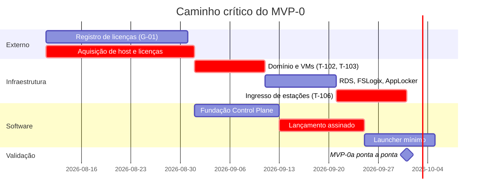

# ROADMAP e BACKLOG — AppBridge
> Entregável 7 de 7 da fase de Design · Sessão S001 · 2026-08-08
> Status: **✅ aprovado por Frederico em 2026-08-08** (RP-04)
> Depende de: todos os entregáveis anteriores e ADR-0001 a ADR-0012
> Alterado após aprovação: ADR-0013 (marcos, §2 e §5), ADR-0014 (portão G-01) e **ADR-0016**
> (backlog único; incorpora T-207, T-506 e T-1106 da revisão S008)

---

## 1. Como ler este documento

### 1.1 Estimativa relativa

Pontos na escala 1 · 2 · 3 · 5 · 8 · 13. Para permitir a checagem de capacidade da §4, ancoro a
escala:

> `PREMISSA:` (PRE-25) **1 ponto ≈ meio dia de trabalho focado** de um desenvolvedor que conhece a
> stack. É âncora de calibração, não promessa. A velocidade real é desconhecida — este é o primeiro
> projeto na stack — e só a primeira semana de implementação a revela.

### 1.2 Definição de preparado (uma tarefa pode começar quando)

Tem requisito rastreado · tem critério de aceite verificável · as decisões que ela depende estão em
ADR aceito · nenhuma premissa bloqueante em aberto.

### 1.3 Definição de pronto (RP-08, RNF-050)

Código com plano de teste · testes passando · **documentação atualizada** · rastreabilidade
requisito↔código · nenhuma pendência de segurança nova sem registro.

---

## 2. Linha do tempo — vigente

> **Replanejada e aprovada em 2026-08-08 (ADR-0013, opção A).** A §4 mostra por quê; a §5 detalha o
> recorte. A linha do tempo original de P8 está preservada abaixo para comparação.

| Marco | Data vigente | Conteúdo |
|-------|-------------|----------|
| **M1 · Design fechado** | ✅ **2026-08-08** | 7 entregáveis aprovados, 13 ADRs aceitos |
| **M2a · MVP-0a — esqueleto ambulante** | meados de out/2026 | Um usuário, um aplicativo, ponta a ponta, com `.rdp` assinado, trilha e V-01/V-05/V-06 |
| **M2b · MVP-0b — dogfood real** | dez/2026 a jan/2027 | CS-01 a CS-04 integralmente |
| **M2c · MVP-1 (subconjunto do piloto)** | fev a mar/2027 | **Escopo a definir — B-009, R-025** |
| **M3 · Piloto Caminho B** | **abr–jun/2027** | CS-05, 3–5 escritórios pagantes, portões G-01 a G-05 cumpridos |

| Marco original (P8) | Data | Situação |
|---------------------|------|----------|
| Design fechado | fim de ago/2026 | Antecipado |
| MVP-0 completo | meados de out/2026 | **Substituído por M2a + M2b** (ADR-0013) |
| Piloto | 1º tri/2027 | **Substituído por M3 em abr–jun/2027** (ADR-0013) |

---

## 3. Backlog MVP-0

### E-01 · Infraestrutura base — 34 pts · **caminho crítico**

> Não é código, e é a maior fonte de risco de calendário (T-006). Depende de terceiros, de compra e
> de disponibilidade de máquinas e pessoas.

| ID | Tarefa | Critério de aceite | Est. |
|----|--------|--------------------|------|
| T-101 | Adquirir host, Windows Server 2025 e RDS CALs por usuário | Nota fiscal e licenças ativadas; PRE-04 e PRE-18 confirmadas | 3 |
| T-102 | Hyper-V com **AB-DC01 e AB-RDS01 separados** | Duas VMs ativas; `whoami /priv` na AB-RDS01 não mostra usuário final com logon local no DC (ADR-0002, RNF-007) | 5 |
| T-103 | Promover AB-DC01 a controlador de domínio, com sufixo de UPN roteável | Domínio funcional; UPN compatível com o Entra (ADR-0001, riscos) | 5 |
| T-104 | Instalar a pilha RDS na AB-RDS01 e publicar um RemoteApp de teste | RemoteApp abre por `.rdp` manual | 5 |
| T-105 | FSLogix + AppLocker/WDAC em allowlist | Perfil em container; binário não publicado é bloqueado (V-08, RNF-006, RNF-011) | 5 |
| T-106 | **Ingressar as estações no domínio** e aplicar as GPOs: delegação de credenciais restrita, política de redirecionamento, impressão digital do certificado | Estação abre RemoteApp sem pedir senha; disco local não redireciona; `.rdp` não assinado é recusado (ADR-0008, ADR-0009, ADR-0010) | 8 |
| T-107 | Malha privada com ACL restringindo alcance ao 3389; **varredura externa** | V-01 executada e registrada; nenhuma porta RDP visível (CS-04, ADR-0003) | 3 |

**Aceite do épico:** um usuário real abre um RemoteApp a partir da sua estação, sem digitar senha,
sem `mstsc` manual, com a porta 3389 comprovadamente fechada para a internet.

### E-02 · Fundação do Control Plane — 26 pts

| ID | Tarefa | Critério de aceite | Est. |
|----|--------|--------------------|------|
| ~~T-201~~ | ✅ Esqueleto ASP.NET Core, health check, log estruturado com `correlationId` | `/health` responde; um lançamento é rastreável ponta a ponta pelo log (RNF-039, RNF-040) | 3 |
| ~~T-202~~ | ✅ EF Core + PostgreSQL + primeira migração **já com `tenant_id` em todas as tabelas** | Migração aplica e reverte (RNF-052, ADR-0011) | 5 |
| ~~T-203~~ | ✅ `TenantContext` + filtro global no `DbContext` | Consulta sem cláusula explícita não retorna dado de outro tenant (ADR-0004) | 5 |
| ~~T-204~~ | ✅ **Chaves estrangeiras compostas com `tenant_id`** | Tentativa de gravar referência cruzada é recusada **pelo banco** (ADR-0011 §4) | 3 |
| ~~T-205~~ | ✅ `AuditWriter` transacional | Falha simulada de gravação **nega** a operação (V-05, ADR-0007) | 5 |
| ~~T-206~~ | ✅ **Teste automatizado de violação de tenant** | V-02 na suíte; leitura e escrita cruzadas falham (ADR-0004 item 9) | 3 |
| ~~T-207~~ | ✅ **Coluna `purpose` na tabela `launch`** (enum `user_initiated \| prelaunch`) e filtro de prelaunch nas consultas de metering | Contagem de RF-062 **não soma prelaunchs**; teste cobre o caso (ADR-0016, Gap 1) | 2 |

> **T-201 concluída em 2026-08-10 (S010).** `src/AppBridge.ControlPlane.Api` — .NET 10, `AppBridge.slnx`.
> Health check em `/v1/health`, extensível: cada dependência real (PostgreSQL, AD DS, certificado de
> assinatura, `ISessionBackend`) registra seu próprio `IHealthCheck` quando o código que a acessa
> existir, em vez de um stub sem lastro criado hoje. **Nota corrigida em T-301:** esta previsão
> original dizia "PostgreSQL em T-202" — impreciso; T-202 só construiu o schema, sem nenhum
> consumidor em tempo de execução no `Program.cs`. O `IHealthCheck` de PostgreSQL só chegou em T-301,
> a primeira tarefa que de fato conecta ao banco a partir da Api.
> `CorrelationIdMiddleware` grava duas linhas de log por requisição (início e fim), com o
> `CorrelationId` no escopo — **verificado na prática**, não só declarado: um teste captura o log
> real e confirma que o ID aparece nas duas linhas, e que duas requisições concorrentes não
> misturam seus IDs. 7 testes, build sem warning, sem vulnerabilidade conhecida
> (`Microsoft.OpenApi` pinado em 2.11.0 — GHSA-v5pm-xwqc-g5wc).
>
> **Correção de sequenciamento (não é mudança de escopo — RP-07 não se aplica; é ajuste de ordem de
> execução):** `STATUS.md` §3 dizia que E-02 "depende da infraestrutura existir" (E-01). Isso vale
> para o host RDS de produção — não para o esqueleto do Control Plane, que só precisa de um
> PostgreSQL de desenvolvimento. Ambiente de dev instalado nesta sessão: .NET 10 SDK 10.0.302 e
> PostgreSQL 16 local. E-02 segue **em paralelo** com a aquisição de T-101, não depois dela; o que
> continua bloqueado por T-101 é o *deploy* real e os testes de integração contra AD DS/RDS
> verdadeiros (T-503, T-602, e a futura implementação real de `IIdentityProvider` que ADR-0017 §5
> deixou explicitamente fora de T-301).
>
> **T-202 concluída em 2026-08-10 (S010).** `AppBridge.ControlPlane.Domain` (15 entidades, fiéis a
> `MODELO-DE-DADOS.md`) e `AppBridge.ControlPlane.Infrastructure` (EF Core 10 + Npgsql, convenções
> próprias de `snake_case`, conversor de enum e mapeamento de `xmin` do PostgreSQL como token de
> concorrência — sem dependência nova para isso). Migração `InitialCreate` gera as 15 tabelas com
> `tenant_id NOT NULL` em todas exceto `tenant` e `signing_certificate` (as duas exceções
> deliberadas do modelo). **Verificado na prática, não só lido:** a migração foi aplicada e revertida
> de fato contra um PostgreSQL real (`appbridge_dev`), com inserção de dado válido e rejeição
> confirmada — pelo nome da constraint — das duas CHECK (`ck_retention_policy_minimum`,
> `ck_redirection_policy_exception_reason`) e da unicidade de `tenant.slug`. A suíte
> `SchemaTests.cs` (8 testes, banco `appbridge_test` dedicado) automatiza essas mesmas verificações
> e roda `IMigrator` para cima e para baixo dentro do teste — 8 de 8 passando.
>
> **Erro corrigido nesta tarefa:** o build do projeto de teste emitiu `MSB3277` — conflito entre
> `Microsoft.EntityFrameworkCore.Relational` 10.0.4 (trazido transitivamente por
> `Npgsql.EntityFrameworkCore.PostgreSQL` 10.0.3, ainda não realinhado com o EF Core 10.0.10 usado
> diretamente) e 10.0.10. Não havia versão mais nova do pacote Npgsql disponível no NuGet no momento
> desta sessão; corrigido fixando `Microsoft.EntityFrameworkCore.Relational` em 10.0.10 explicitamente
> no `.csproj` da Infrastructure, com comentário explicando o motivo — ponto a revisitar quando o
> Npgsql lançar uma versão alinhada.
>
> A chave estrangeira composta com `tenant_id` (ADR-0011 §4) fica **para T-204**, como planejado —
> cada referência entre entidades carrega um comentário `TODO(T-204)` apontando para a decisão.
>
> **T-203 concluída em 2026-08-10 (S010).** `ITenantContext`/`TenantContext` (Infrastructure) e um
> filtro global aplicado por reflexão a cada tipo de entidade em `OnModelCreating`: quem implementa
> `ITenantScoped` **e** deriva de `AuditedEntity` recebe `TenantId == contexto.TenantId &&
> DeletedAt == null`; quem só implementa uma das duas recebe só a cláusula correspondente. A
> combinação dos dois filtros no mesmo lugar não é invenção desta tarefa — é a consequência que
> ADR-0011 §5 já havia decidido ("toda consulta considere `deleted_at`... junto com o filtro de
> tenant"), executada agora que o `DbContext` finalmente tem de onde ler o tenant corrente.
> **Verificado com PostgreSQL real**, não só por leitura do código: consulta sem `Where` devolve
> só a linha do tenant certo; contexto sem tenant resolvido devolve **zero linhas**, não todas
> (isolamento falha fechado); linha com exclusão lógica some da consulta padrão e reaparece com
> `IgnoreQueryFilters()` — o mesmo mecanismo que o papel de operador do provedor (RF-075, MVP-1)
> vai usar de forma nominal e auditada, não uma trava sem saída. 4 novos testes em
> `TenantIsolationTests.cs`, 12 de 12 passando no projeto de Infraestrutura.
>
> **Erro de infraestrutura de teste corrigido nesta tarefa:** rodar `SchemaTests` e
> `TenantIsolationTests` juntos falhou com `relation "application" does not exist" — não é bug do
> filtro, é corrida: os dois conjuntos de teste migram o mesmo banco `appbridge_test` para cima e
> para baixo, e o xUnit paraleliza classes de teste por padrão. Corrigido serializando o assembly
> (`CollectionBehavior(DisableTestParallelization = true)`) — o banco real e compartilhado é um
> recurso inerentemente serial enquanto não houver Testcontainers.
>
> **T-204 concluída em 2026-08-10 (S010).** 15 chaves estrangeiras compostas `(tenant_id, x_id) ->
> tabela(tenant_id, id)` — todas as referências entre entidades de tenant listadas em
> MODELO-DE-DADOS.md, incluindo três que estavam documentadas no modelo mas sem o comentário
> `TODO(T-204)` no código (`redirection_policy.application_id`, `application_permission.granted_by`/
> `revoked_by`, `launch.session_id`, `access_event.user_account_id`) — corrigidas junto, não
> deixadas para trás. Seis chaves alternativas `UNIQUE (tenant_id, id)` nas entidades que são alvo de
> referência (`application`, `group`, `host_pool`, `session_host`, `session`, `user_account`) — a
> "chave candidata" que o próprio ADR-0011 §4 nomeia. Mais 13 chaves estrangeiras simples `tenant_id
> -> tenant(id)`, uma por tabela com escopo de tenant — declaradas em `MODELO-DE-DADOS.md` como
> `uuid FK` mas nunca antes ligadas ao banco. Todas com `ON DELETE RESTRICT`: um tenant, aplicativo
> ou usuário nunca é fisicamente removido enquanto tiver dado dependente (ADR-0011 §3), então a
> restrição nunca deveria disparar em uso normal — se disparar, é sinal de um `DELETE` que não
> deveria ter sido tentado.
>
> **Verificado com PostgreSQL real, nas duas direções:** uma escrita cruzada de tenant (aplicativo do
> tenant B apontando para o `host_pool` do tenant A) foi tentada por `psql` e recusada com o nome de
> constraint exato (`fk_application_host_pool`); a mesma escrita, com o par `tenant_id`/`host_pool_id`
> correto, foi aceita. 2 novos testes automatizados em `TenantForeignKeyTests.cs` fixam essa mesma
> prova como regressão. `TenantIsolationTests.cs` precisou de correção: usava um `host_pool_id`
> fabricado, válido antes de T-204 porque nada verificava — passou a falhar corretamente depois da
> FK, e foi corrigido para criar um `HostPool` real por tenant. **21 testes automatizados no total**
> no Control Plane (7 Api + 8 Schema + 4 TenantIsolation + 2 TenantForeignKey), todos passando.
>
> **T-205 concluída em 2026-08-10 (S010).** `IAuditWriter`/`AuditWriter`
> (`Infrastructure/Auditing`): um único caminho pelo qual toda operação de segurança (RF-036,
> RF-037, RF-039, RF-041, RF-042) grava seu registro de trilha — `ExecuteAsync` adiciona a entrada de
> auditoria, executa a mutação de estado da concessão (`grant`, síncrona e só-de-banco de propósito:
> a assinatura em si impede que um efeito colateral externo — assinar `.rdp`, chamar
> `ISessionBackend` — entre no limite transacional) e chama `SaveChangesAsync` uma única vez. Se
> qualquer parte falhar, nada é persistido e `AuditWriteFailedException` é lançada — o tipo próprio
> existe para que o endpoint que a chamar (T-301 em diante) responda com o `503 AUDIT_UNAVAILABLE`
> estável de `API.md`/ADR-0012, não um 500 genérico. A falha é sempre logada primeiro (ADR-0007
> condição 2), porque a própria trilha em banco é o que falhou.
>
> **Verificado com uma falha de gravação simulada, não hipotética**: um `SaveChangesInterceptor` de
> teste (`ThrowingSaveChangesInterceptor`) lança exatamente no ponto em que o EF Core emitiria o SQL
> — a janela específica que o ADR-0007 fecha (banco que lê mas não escreve). Com ele, `ExecuteAsync`
> lança `AuditWriteFailedException` e, lido de volta por um contexto limpo, **nem a linha de
> auditoria nem a mutação da concessão foram gravadas** — a negação é da operação inteira, não só da
> metade da auditoria. Um terceiro teste confirma a linha de log de erro antes do relançamento.
> 3 novos testes em `AuditWriterTests.cs`. **24 testes automatizados no total** no Control Plane
> (7 Api + 8 Schema + 4 TenantIsolation + 2 TenantForeignKey + 3 AuditWriter), todos passando.
>
> **Interrupção de ambiente nesta tarefa, sem relação com o código:** o PostgreSQL local havia parado
> entre sessões (`service postgresql status` → `down`); reiniciado (`service postgresql start`) antes
> de rodar os testes. Não é achado de produto — registrado porque `docs/SETUP-DEV.md` já orienta como
> subir o banco, mas não como diagnosticar que ele caiu.
>
> **T-206 concluída em 2026-08-10 (S010).** `TenantViolationTests.cs` — o local explícito e nomeado
> da suíte para **V-02** (`SEGURANCA.md` §7: "tentar ler e gravar dados de outro tenant e exigir
> falha", AM-07/AM-14). T-203 e T-204 já provavam os dois mecanismos, mas só com `Application` (leitura)
> e `application`/`host_pool` (escrita); esta tarefa fechou duas lacunas reais de forma, não de
> volume: (1) nenhum teste anterior havia exercitado `SetTenantFilter` sozinho — o caminho que
> entidades de trilha (sem `deleted_at`, ADR-0011 §3) percorrem, distinto de
> `SetTenantAndSoftDeleteFilter` — fechada com um caso em `AccessEvent`; (2) nenhum teste anterior
> cobria uma FK composta **anulável** nem uma tabela com **duas FKs independentes para o mesmo tipo
> principal** (`application_permission.granted_by`/`revoked_by`, ambas para `user_account` — o
> desenho mais propenso a esconder um erro de configuração por cópia-e-cola) — fechadas com
> `redirection_policy.application_id` e `application_permission.granted_by`. **Cobertura
> deliberadamente não exaustiva**: as 13 tabelas com escopo de tenant e as 15 FKs compostas não são
> testadas uma a uma — ADR-0004 item 9 pede casos que provem o mecanismo, não uma matriz
> combinatória, e os dois mecanismos já foram exercitados em cinco formas distintas de
> entidade/relacionamento entre este arquivo e T-203/T-204. **28 testes automatizados no total** no
> Control Plane (7 Api + 8 Schema + 4 TenantIsolation + 2 TenantForeignKey + 3 AuditWriter + 4
> TenantViolation), todos passando contra PostgreSQL real.
>
> **T-207 concluída em 2026-08-10 (S010).** A coluna `purpose` e o enum `LaunchPurpose` já existiam
> desde T-202 — o que faltava era o teste que o próprio critério de aceite pede. `LaunchPurposeMeteringTests.cs`
> grava três lançamentos `user_initiated` e dois `prelaunch` e confirma que uma contagem filtrada por
> `purpose = user_initiated` devolve 3, não 5 — exatamente o que ADR-0016 Gap 1 exige de qualquer
> consulta futura de RF-062. **Não é um serviço de metering** (RF-062 é MVP-1, ADR-0006, e ainda não
> tem endpoint): o teste prova a garantia na camada de dados que esse serviço vai usar, não simula o
> serviço em si — inventar um antes da hora seria escopo além do que T-207 pede (RP-05). **29 testes
> automatizados no total** no Control Plane (7 Api + 22 Infrastructure), todos passando. **E-02 ·
> Fundação do Control Plane está com todas as suas 7 tarefas concluídas.**

### E-03 · Identidade e autorização — 21 pts

| ID | Tarefa | Critério de aceite | Est. |
|----|--------|--------------------|------|
| ~~T-301~~ | ✅ `POST /auth/session`, com registro na mesma transação | Login gera `access_event`; falha de trilha devolve `503 AUDIT_UNAVAILABLE` | 8 |
| ~~T-302~~ | ✅ Vínculo identidade → conta AD por **SID** | Renomear a conta no AD não quebra o vínculo nem a trilha (RF-002) | 5 |
| ~~T-303~~ | ✅ Refresh, logout **(servidor)** e armazenamento no Credential Manager | Token renova sem login; logout invalida (RF-004..RF-006) | 5 |
| ~~T-304~~ | ✅ `AuthorizationService` com vigência de permissão | Permissão revogada nega o lançamento seguinte em ≤ 60 s (V-07, RNF-030) | 3 |

> **T-301 concluída em 2026-08-10 (S010).** `POST /v1/auth/session` implementado e verificado de
> ponta a ponta — construído sobre tudo que E-02 preparou (`AppBridgeDbContext`, `ITenantContext`,
> `IAuditWriter`), agora com consumidor real pela primeira vez.
>
> **Lacuna encontrada e fechada durante a implementação, com ADR próprio:** `API.md` já prometia
> `refreshToken` na resposta e `POST /v1/auth/refresh` (T-303), mas `MODELO-DE-DADOS.md` não tinha
> tabela para persistir um — sem estado do lado do servidor, `logout` (RF-006) não teria o que
> revogar. **ADR-0017** decide os dois pontos que faltavam: `accessToken` em JWT HS256 (chave via
> `APPBRIDGE_JWT_SIGNING_KEY`, nunca arquivo — RP-06), e `refreshToken` opaco guardado **só como hash
> SHA-256** (nunca o valor), em nova tabela `refresh_token` (`MODELO-DE-DADOS.md` §4.3), seguindo as
> convenções de sempre (ADR-0011: UUID v7, `timestamptz`, FK composta com `tenant_id`).
>
> **Nenhuma integração real com Entra ID/AD DS nesta tarefa** (ADR-0017 §5) — E-01 não tem hardware
> comprado, não existe domínio nem tenant Entra para validar contra. Escrever uma implementação "real"
> sem nada para testá-la violaria a disciplina deste projeto de rodar para verificar. `IIdentityProvider`
> é a interface (Infrastructure); `DevIdentityProvider` (Api, registrado **só sob `Development`**)
> existe para permitir rodar e testar o endpoint nesta sessão — ver R-032. `AddAuthentication().AddJwtBearer()`
> também já está registrado em `Program.cs`, sem nenhum endpoint protegido para exercitá-lo ainda —
> mesmo raciocínio de T-201 para o health check: o mecanismo entra quando a decisão de claims é
> tomada, não quando o primeiro consumidor aparece.
>
> **`AppBridgeDbContext`/`ITenantContext`/`IAuditWriter` finalmente registrados no `Program.cs`** —
> T-301 é a primeira tarefa com consumidor real em tempo de execução, exatamente como antecipado ao
> fechar E-02. O health check ganhou `postgresql` como primeira dependência real (a nota de T-201
> dizia "PostgreSQL em T-202" — impreciso; T-202 só construiu o schema, T-301 é quem de fato conecta
> em runtime, corrigido aqui).
>
> **Verificado rodando a aplicação de verdade** (`dotnet run`, não só os testes): login bem-sucedido
> grava `access_event` (`result = success`) e `refresh_token`, atualiza `last_login_at`, devolve
> `201` com os tokens; token inválido, usuário desconhecido (com tenant resolvido), usuário
> desabilitado e tenant suspenso devolvem os códigos exatos de `API.md` (`INVALID_IDENTITY_TOKEN`,
> `USER_DISABLED`, `TENANT_SUSPENDED`), cada um com o `access_event` de falha correspondente quando
> há tenant para atribuir. **13 novos testes automatizados** (6 em `AuthEndpointTests.cs`, contra o
> host real via `WebApplicationFactory` e PostgreSQL real — incluindo a falha de gravação simulada
> por `SaveChangesInterceptor` devolvendo `503 AUDIT_UNAVAILABLE`, a mesma técnica de T-205 agora
> provada na fronteira HTTP; 2 em `JwtSessionTokenIssuerTests.cs`, sem banco, provando que o token
> emitido valida com a mesma chave e falha com uma diferente; e as 3 suítes pré-existentes de T-201
> precisaram de ajuste — ver correções abaixo). **37 testes automatizados no total** no Control Plane
> (13 Api + 24 Infrastructure), todos passando.
>
> **Duas correções de teste encontradas rodando a suíte, nenhuma de produto:**
> 1. Os três arquivos de teste de T-201 (`HealthCheckTests`, `CorrelationIdMiddlewareTests`,
>    `RequestLoggingTests`) quebraram porque `Program.cs` passou a exigir `APPBRIDGE_DB_CONNECTION`/
>    `APPBRIDGE_JWT_SIGNING_KEY` para iniciar — correto, é uma dependência real agora. Corrigido
>    centralizando a configuração de teste em `ApiTestFactory.cs`, reaproveitada pelos quatro
>    arquivos de teste do projeto Api.
> 2. `ApiTestFactory` inicialmente injetava a configuração via `ConfigureAppConfiguration` (padrão
>    comum do `WebApplicationFactory`) — não funcionou, porque `Program.cs` lê a configuração
>    obrigatória **antes** de `Build()`, e o `ConfigureAppConfiguration` do `WebApplicationFactory`
>    só se aplica no ponto em que ele intercepta `Build()`, tarde demais para o `?? throw` logo após
>    `CreateBuilder(args)`. Corrigido definindo variáveis de ambiente reais no processo — que
>    `CreateBuilder` já lê como uma das suas próprias fontes padrão, de forma síncrona.
>
> **T-303 concluída em 2026-08-10 (S010) — escopo restrito ao servidor.** O título da tarefa mistura
> dois lados: `POST /v1/auth/refresh` e `POST /v1/auth/logout` (esta tarefa) e o armazenamento no
> Windows Credential Manager (RF-005), que já é **T-803** por direito próprio, em `E-08 · Launcher —
> fundação` — um projeto WinUI que não existe neste repositório. Construir o launcher agora para
> "completar" o título seria inventar escopo que T-303 não pede (RP-05); o armazenamento cliente
> continua para quando E-08 começar.
>
> `POST /v1/auth/refresh`: encontra o `refresh_token` pelo hash do valor apresentado (única forma de
> saber o tenant neste ponto — segundo uso legítimo de `IgnoreQueryFilters()`, depois do de T-301,
> ambos pela mesma razão de bootstrap), confere validade/revogação/expiração, **revoga o token
> apresentado e emite um novo** (rotação: reutilizar um token já trocado — a assinatura de um roubo —
> passa a falhar a partir da primeira troca), e reconfere `TenantStatus`/`UserAccountStatus` **de
> novo** (um usuário desabilitado depois de emitido o refresh token não pode continuar renovando
> sessão). **Não passa por `IAuditWriter`** — decisão registrada, não esquecimento: ADR-0007 Parte 1
> não lista RF-004 entre os eventos bloqueantes, e `MODELO-DE-DADOS.md` §7.2 não categoriza refresh
> como tipo de `access_event` (só autenticação, logout e fim de sessão). `POST /v1/auth/logout`: a
> mesma busca, mas **grava `access_event` (`logout`) via `IAuditWriter`** — este sim está na
> categorização de §7.2 — e é idempotente por desenho: token desconhecido ou já revogado devolve
> `204` igual a um logout que revogou de verdade, sem distinguir os casos (mesmo raciocínio
> anti-enumeração de ADR-0012 §5).
>
> **Bug real encontrado e corrigido, não só de T-303**: inspecionar `refresh_token.created_at`
> durante a verificação mostrou `-infinity` — `CreatedAt`/`UpdatedAt` são `init`-only por desenho
> (imutabilidade de domínio), mas **nada em código nenhum jamais os definia**, então todo `INSERT`
> desde T-202 gravava `DateTimeOffset.MinValue` silenciosamente. Corrigido no único lugar que
> resolve para sempre: `AppBridgeDbContext.SaveChanges(Async)` agora carimba `CreatedAt` em toda
> entidade `Added` e `UpdatedAt` em toda `Modified`, via `entry.Property(...).CurrentValue` — que
> continua funcionando sobre uma propriedade `init` porque o rastreador de mudanças do EF Core opera
> abaixo da restrição de tempo de compilação do C#, o mesmo mecanismo que já materializa entidades
> vindas do banco. Mesma disciplina de "mecanismo, não lembrete" de T-203/T-204/T-205.
>
> **Segundo bug encontrado e corrigido no mesmo lote, em código já publicado (T-301)**: nenhuma das
> duas requisições (`LoginRequest.IdentityToken`, e agora `RefreshTokenRequest.RefreshToken`) exigia
> a presença do campo — um corpo sem ele vinculava `null` silenciosamente (o C# não-anulável não é
> garantia de tempo de execução sem `required`), e a próxima linha de código lançava
> `NullReferenceException`, virando um `500` genérico em vez de um `400` claro. Corrigido marcando os
> dois campos como `required`; verificado enviando `{}` de propósito e confirmando `400 Bad Request`,
> não mais uma exceção não tratada.
>
> **Verificado rodando a aplicação de verdade** (`dotnet run` + `curl` + `psql`): sessão completa —
> login, refresh (token novo, token antigo revogado), reuso do token antigo recusado, logout,
> segundo logout idempotente, refresh após logout recusado, corpo malformado devolvendo `400`. **12
> novos testes automatizados**: 9 em `RefreshLogoutEndpointTests.cs` (cada um fazendo login de
> verdade pelo endpoint real antes de exercitar refresh/logout, não montando um token à mão), 3 em
> `AuditColumnStampingTests.cs` (`CreatedAt` carimbado na inserção, `UpdatedAt` na modificação, e o
> valor sobrevive a uma releitura real do PostgreSQL — não bastaria não lançar exceção, porque
> `-infinity` também "funciona" sem erro). **49 testes automatizados no total** (22 Api + 27
> Infrastructure), todos passando.
>
> **Achado à parte, sem relação com código:** o cabeçalho `### E-04 · Catálogo — 11 pts` tinha
> desaparecido do arquivo — removido sem querer pela edição que registrou a conclusão de T-301 (a
> âncora do texto substituído incluía a linha do título, e o texto novo não a repôs). A tabela de
> T-401 a T-404 continuava presente, só sem o título da seção. Corrigido nesta sessão, ao notar a
> ausência ao navegar o arquivo para esta mesma nota — reforça por que revisar o `diff` antes de
> commitar, não só confiar que um `Edit` bem-intencionado preservou tudo ao redor.

> **T-304 concluída em 2026-08-10 (S010).** `IAuthorizationService`/`AuthorizationService`
> (`AppBridge.ControlPlane.Infrastructure/Authorization/`) — o componente `AuthorizationService`
> que `ARQUITETURA.md` §5.2 já documentava (`RF-007, RF-021, RF-039 | ADR-0004`), agora escrito.
> **Escopo confirmado antes de codificar**: `ROADMAP.md` não tem nenhuma outra tarefa para
> conceder/revogar permissão via API (`ApplicationPermission`/`UserGroupMembership` já existem
> completas desde T-202/T-204) — T-304 é só a lógica de decisão, testada manipulando linhas
> diretamente, não um endpoint administrativo (isso pertence a E-04/E-05, que ainda não começaram).
>
> Contrato deliberadamente mínimo — um único método, `HasActivePermissionAsync(userAccountId,
> applicationId)`, devolvendo `bool`, sem enum de motivo de negação — porque um contrato mais rico
> serviria só ao futuro endpoint `/launch` (E-05), que ainda não existe; construir para ele agora
> seria escopo além do que T-304 pede (RP-05). Isolamento entre tenants não é reimplementado aqui:
> `UserGroupMemberships` e `ApplicationPermissions` já são `DbSet`s com filtro por tenant (ADR-0004,
> T-203), então uma consulta cruzando tenants simplesmente não encontra nada, sem código especial
> para isso — mecanismo já provado por T-203/T-206, não re-testado nesta tarefa.
>
> **A leitura de vigência não usa cache** — `EffectiveFrom <= agora && (EffectiveTo == null ||
> EffectiveTo > agora)` é avaliada direto no banco a cada chamada — e é essa ausência de cache que
> torna o RNF-030 ("permissão revogada nega o lançamento seguinte em ≤ 60 s") verdadeiro por
> construção: os testes provam "nega na checagem imediatamente seguinte à revogação", sem precisar
> de espera de relógio nenhuma, porque não existe janela de staleness a cronometrar.
>
> **6 novos testes automatizados** em `AuthorizationServiceTests.cs`: permissão dentro da janela
> concede; revogar nega a checagem seguinte (a prova literal de V-07/RNF-030); nenhuma permissão
> nega; permissão de outro aplicativo não concede; permissão ainda não vigente (`EffectiveFrom` no
> futuro) nega; permissão já revogada no passado nega. **Verificado registrando `IAuthorizationService`
> no `Program.cs`** (ao lado de `IAuditWriter`/`ISessionTokenIssuer`) e subindo a aplicação real
> (`dotnet run`) para confirmar que a injeção de dependência resolve sem erro — sem consumidor ainda
> (isso é E-05), então não há endpoint para exercitar via `curl` nesta tarefa. **55 testes
> automatizados no total** (22 Api + 33 Infrastructure), todos passando.

> **T-302 concluída em 2026-08-10 (S010) — E-03 completo.** `MODELO-DE-DADOS.md` §4.1 já guardava
> `ad_object_sid` desde T-202 e já explicava por quê ("SID, não `sAMAccountName`: sobrevive a
> renomeação"), mas nenhum código lia, verificava ou atualizava esse campo — ele existia só como
> coluna. T-302 é o que faz o vínculo que ADR-0001 item 4 promete ("o vínculo... já existe desde o
> primeiro dia") funcionar de verdade dentro do fluxo de login.
>
> **Desenho:** `IdentityValidationResult` (`IIdentityProvider`) ganhou `Upn`/`DisplayName`
> opcionais — os valores atuais do diretório, lidos frescos a cada validação, não em cache.
> `AuthEndpoints.Login` agora chama `SyncDirectoryAttributes` depois de resolver o usuário: se o
> `Upn`/`DisplayName` que o provedor devolveu diverge do que está gravado, atualiza **a mesma
> linha**, na mesma transação que já grava `LastLoginAt`/`RefreshToken`. **`AdObjectSid` nunca é
> escrito por este caminho** — é `required` na provisão, MVP-0 não tem endpoint de provisão ainda
> (isso é E-04+), e é exatamente o campo que `MODELO-DE-DADOS.md` já documentava como imune a
> renomeação; sincronizar algo que uma renomeação legítima não muda seria inventar um mecanismo
> sem motivo (RP-05).
>
> **Por que não trocar a chave de busca do login para SID**: `ExternalSubject` (Entra `oid`) já é,
> por desenho do próprio Entra ID, estável a renomeação — ADR-0001 descreve os dois papéis como
> distintos (`external_subject` é "quem autentica no Control Plane"; `ad_object_sid` é "qual conta
> abre a sessão RDS"). Trocar a chave de resolução misturaria os dois papéis sem que nenhum
> requisito pedisse isso. Nenhuma verificação/negação de divergência de SID foi construída — `
> API.md` não documenta um código de erro para esse caso, e inventar um agora seria alterar o
> contrato de API sem que a tarefa pedisse (RA-06).
>
> `DevIdentityProvider` ganhou uma forma estendida de token —
> `dev:{externalSubject}:{adDomain}:{upn}:{displayName}` — que simula uma leitura fresca do
> diretório sem tocar no formato de três partes que todo teste anterior desta sessão já usa
> (`Split(':', 5)`; `parts.Length < 3` continua a única condição de invalidez, então tokens de 3
> partes continuam se comportando exatamente como antes).
>
> **Verificado rodando a aplicação de verdade** (`dotnet run` + `curl` + `psql`), o próprio cenário
> do critério de aceite: login, "renomeação" (segundo login com UPN/nome novos, mesmo
> `external_subject`/SID), e conferência direta no banco — **uma única linha** de `user_account`
> (mesmo `id`), `ad_object_sid` inalterado, `upn`/`display_name` atualizados, e os **dois**
> `access_event` de login (antes e depois da renomeação) apontando para o mesmo `user_account_id` —
> a trilha não quebrou.
>
> **2 novos testes** em `UserAccountSidLinkTests.cs`: renomear atualiza `Upn`/`DisplayName` na
> mesma linha sem duplicar conta e sem quebrar a trilha; um login sem atributos de diretório no
> token (forma curta) não altera o que já estava gravado. **57 testes automatizados no total** (24
> Api + 33 Infrastructure), todos passando. **Nenhum bug encontrado durante a verificação.** Com
> T-302, **E-03 · Identidade e autorização está com as 4 tarefas concluídas.**

### E-04 · Catálogo — 11 pts

| ID | Tarefa | Critério de aceite | Est. |
|----|--------|--------------------|------|
| ~~T-401~~ | ✅ Seed de aplicativos em JSON/tabela | Catálogo carregado sem painel (RF-012) | 3 |
| ~~T-402~~ | ✅ `GET /applications` com filtro por autorização | Aplicativo não autorizado **não aparece** (RF-011) | 3 |
| T-403 | `ETag` / `If-None-Match` | Segunda sincronização devolve `304` (RF-015) | 2 |
| T-404 | Endpoint de ícone | Serve PNG com cache; resolve PD-03 | 3 |

> **T-401 concluída em 2026-08-10 (S010).** `CatalogSeeder`
> (`AppBridge.ControlPlane.Infrastructure/Catalog/`) grava direto nas tabelas `application`/
> `host_pool` via EF Core — sem arquivo JSON separado, porque nada além do próprio seed leria um, e
> RF-012 trata "JSON ou tabela" como formas alternativas de um mesmo requisito ("sem painel
> administrativo"), não como exigência de as duas existirem. Dataset fixo do dogfood
> (`VISAO.md` §1/PA-01): Domínio Contábil e Alterdata, ambos `Published`, num único `HostPool`
> ("Pool Principal") criado sob demanda.
>
> **Sem endpoint HTTP novo, de propósito** — um verbo de CLI (`dotnet run -- seed-catalog
> <ad-domain>`) antes de `app.Run()`, não uma rota. Expor isso como endpoint seria, na prática, o
> começo do próprio painel administrativo que RF-012 diz que o MVP-0 não tem (esse painel é RF-043,
> MVP-1).
>
> **Idempotente por desenho** — verificado rodando duas vezes seguidas contra `appbridge_dev` real:
> a segunda chamada não duplica `application` nem `host_pool` (a checagem de existência usa o mesmo
> escopo do índice único `uq_application_tenant_alias_pool`, MODELO-DE-DADOS.md §5.1). Tenant
> desconhecido devolve código de saída `1` com mensagem no `stderr`, sem alterar nada no banco
> (verificado separadamente do `stdout`, já que `dotnet run` sempre devolve `0` quando encadeado
> num pipe — o próprio código de saída do `dotnet run` só reflete o do processo publicado quando
> lido sem pipe no meio).
>
> **Escopo deliberadamente não inclui** `IconRef` (isso é T-404, dono do endpoint de ícone) nem
> `ApplicationPermission`/`Group` (isso é T-402, que precisa desses dados como fixture do próprio
> teste de autorização, não como responsabilidade do seed de catálogo). RF-013 lista "grupo de
> permissão" entre os campos mínimos do catálogo, mas o critério de aceite de T-401 é
> especificamente "catálogo carregado sem painel" — os outros campos chegam com as tarefas que os
> usam, não antecipados aqui.
>
> **2 novos testes** em `CatalogSeederTests.cs`: `SeedAsync` popula os dois aplicativos, publicados,
> com `HostPoolId` válido, num único `HostPool`; rodar duas vezes não duplica nem `application` nem
> `host_pool`. **59 testes automatizados no total** (24 Api + 35 Infrastructure), todos passando.
> **Nenhum bug encontrado durante a verificação desta tarefa.**

> **T-402 concluída em 2026-08-10 (S010).** `GET /v1/applications` (API.md §3) — a primeira rota
> `[Authorize]` do Control Plane. Escopo restrito ao que a linha do `ROADMAP.md` pede: a listagem
> filtrada por autorização. `ETag`/`If-None-Match` (RF-015) é T-403; o endpoint de ícone (PD-03) é
> T-404; `GET /v1/applications/{id}` (detalhe) não tem tarefa própria no roadmap e não foi
> construído — `API.md` já o documenta, mas documentar não é mandato de implementar em toda tarefa
> da mesma seção (mesmo raciocínio de T-301 não ter implementado `/refresh` só porque `API.md` já o
> descrevia).
>
> **Peça de infraestrutura nova, não antecipada por nenhuma tarefa anterior**:
> `TenantResolutionMiddleware` (`Api/Middleware/`). Até aqui, todo endpoint resolvia
> `TenantContext.TenantId` consultando o banco dentro do próprio handler (login resolve por
> `Tenant.AdDomain`; refresh/logout, pelo hash do token) — não havia ainda uma rota que exigisse
> **um token de sessão já emitido** como a única fonte de tenant. A claim `tenant_id` já existe no
> JWT desde `JwtSessionTokenIssuer` (ADR-0017 §1); o middleware só lê essa claim e carimba
> `TenantContext` depois de `UseAuthentication()` e antes de `UseAuthorization()`/execução do
> endpoint — o comentário em `ITenantContext.cs`/`TenantContext.cs` já previa isso desde T-203
> ("T-301's auth middleware sets it early in the pipeline"), mas nenhuma tarefa antes de T-402 tinha
> uma rota que precisasse dele de verdade.
>
> **`IAuthorizationService` ganhou um segundo método**, `GetAuthorizedApplicationIdsAsync` — a forma
> em lote que `CatalogService` precisa (`ARQUITETURA.md` §4 desenha `CatalogService --> 
> AuthorizationService`), reaproveitando a mesma janela de vigência de `HasActivePermissionAsync`
> (T-304) em vez de duplicá-la. O endpoint ainda aplica seu próprio filtro de `Application.Status ==
> Published` por cima — um aplicativo pode estar autorizado e ainda não publicado.
>
> **Bug real encontrado durante a verificação manual — mas na minha própria semeadura via `psql`,
> não no código**: a primeira tentativa de popular `application`/`group`/`user_group_membership`
> manualmente usou literais numéricos (`status=1`, `launch_mode=0`, `source=0`) como se as colunas
> fossem inteiras — na verdade são `text`, porque o EF Core converte esses enums para string
> minúscula (`'published'`, `'remote_app'`, `'local'`). O resultado gravado foi a string `"1"`, que
> nunca bate com `a.status = 'published'` na consulta real — o catálogo respondia `200` com
> `items: []` mesmo com a permissão certa concedida. Diagnosticado comparando o SQL gerado pelo EF
> Core (log estruturado) com o dado gravado via `psql \d application` (revelou o tipo `text`), não
> com um `Assert` — os testes automatizados usam `DbContext.Applications.Add(...)`, então nunca
> passariam por esse valor errado; só a semeadura manual, fora do EF Core, expôs a discrepância entre
> "o que eu digitei" e "o que o conversor de enum realmente grava". Corrigido a mão no dado de
> verificação (não é bug de produção); registrado aqui porque é exatamente o tipo de erro que se
> repetiria em qualquer script de seed manual futuro fora do `CatalogSeeder`.
>
> **Verificado rodando a aplicação de verdade**: tenant/usuário/aplicativo/grupo/permissão semeados
> via `psql` (com o valor de enum corrigido), login real, `GET /v1/applications` sem token → `401`;
> com token → `Domínio Contábil` aparece, `Alterdata` (nunca autorizado) não aparece.
>
> **8 novos testes**: 3 em `AuthorizationServiceTests.cs` (`GetAuthorizedApplicationIdsAsync` —
> devolve só o autorizado vigente; exclui permissão revogada; usuário sem vínculo nenhum devolve
> vazio) e 5 em `CatalogEndpointTests.cs` (sem token → `401`; autorizado e publicado aparece;
> não autorizado não aparece; autorizado mas `Draft` não aparece; token de um tenant nunca vê
> aplicativo autorizado de outro tenant). **67 testes automatizados no total** (29 Api + 38
> Infrastructure), todos passando.

### E-05 · Lançamento — 32 pts · **coração do produto**

| ID | Tarefa | Critério de aceite | Est. |
|----|--------|--------------------|------|
| T-501 | `RdpDescriptorBuilder` aplicando a política de redirecionamento | `.rdp` gerado nega unidades locais e permite impressora (ADR-0008) | 5 |
| T-502 | `IRdpFileSigner` + `RdpSignExeSigner` | `.rdp` assinado e aceito pela estação; **falha de assinatura devolve `503`** (V-06, RNF-002, ADR-0009) | 8 |
| T-503 | `ISessionBackend` + `RdsSessionBackend` (resolução de host e descritor) | Nenhuma regra de negócio referencia tipo do RDS (RNF-035) | 8 |
| T-504 | `POST /launches` com autorização, trilha e `Idempotency-Key` | Repetir a chave não cria segundo lançamento nem segunda contagem (ADR-0012 §3) | 5 |
| T-505 | Catálogo de erros com códigos estáveis | Cada situação da tabela de `API.md` §9 devolve o código correto | 3 |
| **T-506** | **Operação de cancelamento em `ISessionBackend`**, chamada no caminho de falha do prelaunch, com registro na trilha | Prelaunch que falha após criar a sessão **não deixa sessão contando licença**; teste force a falha (ADR-0016, Gap 2) | 3 |

### E-06 · Sessão e reconciliação — 16 pts

| ID | Tarefa | Critério de aceite | Est. |
|----|--------|--------------------|------|
| T-601 | `SessionRegistry` — início, reutilização e vínculo com o lançamento | Segundo aplicativo reutiliza a sessão (RF-024) | 5 |
| T-602 | `SessionReconciler` contra o Connection Broker, com `reconciled_missing` e `stale_expired` | Sessão encerrada fora do AppBridge é fechada em até um ciclo; **valida PRE-23** (R-009) | 8 |
| T-603 | `GET /sessions/me` | Launcher exibe sessões ativas | 3 |

### E-07 · Trilha e retenção — 13 pts

| ID | Tarefa | Critério de aceite | Est. |
|----|--------|--------------------|------|
| T-701 | Tabelas `launch` e `access_event` append-only | Sem caminho de `UPDATE`/`DELETE` na aplicação (RNF-019) | 5 |
| T-702 | `GET /audit/launches` e `/audit/access-events` | Consulta com filtro e cursor (RF-040) | 3 |
| T-703 | `RetentionWorker` + `purge_run` | Expurgo respeita o mínimo e **registra a si mesmo** (RNF-018, ADR-0007) | 5 |

### E-08 · Launcher — fundação — 26 pts

| ID | Tarefa | Critério de aceite | Est. |
|----|--------|--------------------|------|
| T-801 | Projeto WinUI 3 + MSIX + empacotamento | Instala sem privilégio administrativo; **testa PRE-17** (RNF-044) | 8 |
| T-802 | `ApiClient` com token, renovação e tratamento dos códigos de erro | Cada código produz mensagem em pt-BR acionável (RF-025, RNF-043) | 5 |
| T-803 | `CredentialStore` no Windows Credential Manager | Token não aparece em arquivo nem no SQLite (RF-005) | 3 |
| T-804 | Cache do catálogo em SQLite | Interface abre sem rede, com aviso de estado (RF-014) | 5 |
| T-805 | Interface do catálogo: lista, ícones, estado, latência | Usuário identifica seus aplicativos sem treinamento (RF-026, RNF-042) | 5 |

> **Gatilho do ADR-0005:** se T-801, T-901 e T-902 juntos passarem de **10 pontos reais**, o launcher
> migra para WPF via ADR novo. A medição é objetiva e a decisão já está tomada — só falta o dado.

### E-09 · Launcher — integração com o desktop — 16 pts

| ID | Tarefa | Critério de aceite | Est. |
|----|--------|--------------------|------|
| T-901 | Registro e tratamento de `appbridge://launch/<app>` | Duplo clique no atalho abre o aplicativo (RF-029) | 5 |
| T-902 | "Instalar meus aplicativos": atalhos no Desktop e Menu Iniciar | Atalhos com ícone correto, apontando para o protocolo (RF-030, RF-031) | 5 |
| T-903 | **Remoção de atalho na revogação** | Aplicativo revogado some do Desktop na sincronização seguinte (RF-032) | 3 |
| T-904 | Início com o Windows e ícone na bandeja | Launcher disponível sem o usuário abri-lo (RF-033) | 3 |

### E-10 · Launcher — lançamento e prelaunch — 19 pts

| ID | Tarefa | Critério de aceite | Est. |
|----|--------|--------------------|------|
| T-1001 | `LaunchCoordinator`: pede, grava com TTL, chama `mstsc`, **apaga** | Nenhum `.rdp` sobrevive ao lançamento nem ao TTL (RF-020, RF-022) | 5 |
| T-1002 | SessionPrimer publicado + `PrelaunchService` | Sessão pronta no logon; **valida PRE-22** — o prelaunch sustenta a jornada? (RF-023, R-015) | 8 |
| T-1003 | Medição do tempo de abertura | Número real de RNF-027 registrado, com e sem prelaunch; **valida PRE-11** | 3 |
| T-1004 | Reutilização de sessão no segundo aplicativo | Sem nova sessão, sem nova credencial (RF-024) | 3 |

### E-11 · Segurança e verificação — 18 pts

| ID | Tarefa | Critério de aceite | Est. |
|----|--------|--------------------|------|
| T-1101 | **PS-05** — permissões mínimas da conta de serviço no AD e no banco | Conta sem administração de domínio; documentado (RNF-005) | 3 |
| T-1102 | **PS-09** — limites de taxa por endpoint | `429` com `Retry-After` sob excesso (RNF-010, AM-23) | 3 |
| T-1103 | **PS-10** — procedimento de comprometimento do certificado de assinatura | Documento com passos de rotação e revogação (AM-02) | 2 |
| T-1104 | Executar V-01, V-04, V-05, V-06, V-07, V-08 e registrar | Todas as verificações de MVP-0 com resultado arquivado | 5 |
| T-1105 | Filtro de campos sensíveis no log | Nenhum segredo em log, verificado por amostragem (RNF-004) | 3 |
| **T-1106** | **PS-04 antecipada** — varredura automática de segredos no repositório | Detecção roda a cada alteração e falha o build ao encontrar (AM-20; era MVP-1, antecipada por ADR-0016) | 2 |

### E-12 · Operação e dogfood — 16 pts

| ID | Tarefa | Critério de aceite | Est. |
|----|--------|--------------------|------|
| T-1201 | Backup diário + **restauração testada** | V-09 executada em ambiente separado (RNF-033) | 5 |
| T-1202 | Alerta de espaço em disco e de saúde | Disco baixo alerta **antes** de virar indisponibilidade (R-012, AM-22) | 3 |
| T-1203 | **Roteiro operacional**, incluindo o procedimento de desligamento de usuário no MVP-0 | Escrito: desabilitar no AD **e** encerrar sessão manualmente no host (R-014, AM-30) | 3 |
| T-1204 | Semana de dogfood dirigido, com registro de defeitos e medições | CS-01, CS-02 e CS-03 evidenciados | 5 |

---

## 4. Checagem de capacidade — o número inconveniente

| Épico | Pontos |
|-------|--------|
| E-01 Infraestrutura | 34 |
| E-02 Fundação do Control Plane | 26 |
| E-03 Identidade | 21 |
| E-04 Catálogo | 11 |
| E-05 Lançamento | 32 |
| E-06 Sessão | 16 |
| E-07 Trilha | 13 |
| E-08 Launcher — fundação | 26 |
| E-09 Launcher — desktop | 16 |
| E-10 Launcher — lançamento | 19 |
| E-11 Segurança | 18 |
| E-12 Operação | 16 |
| **Total MVP-0** | **248** |

Com a âncora de PRE-25 (1 ponto ≈ meio dia): **≈ 124 dias de trabalho focado**.

> **Atualizado por ADR-0016:** o total subiu de 241 para 248 pontos com a incorporação de T-207,
> T-506 e T-1106, vindos da revisão S008.

A janela de P8 vai do fim de agosto a meados de outubro: **≈ 32 dias úteis**. E esses dias não são
integrais — Frederico dirige um escritório de contabilidade, o que reduz a dedicação a uma fração
`PREMISSA:` (PRE-26) de talvez 40% a 60%.

| Cenário | Dias disponíveis | Cobertura do escopo |
|---------|------------------|---------------------|
| Dedicação integral | 32 | 27% |
| Dedicação de 50% | 16 | 13% |
| **Se eu estiver errado por um fator de 2** (otimista) | 32 | 53% |

**Conclusão, sem rodeios: o MVP-0 completo não cabe até meados de outubro.** A conclusão é robusta —
mesmo que minha estimativa esteja errada pela metade, o escopo não entra. Isso não é falha de
planejamento: é o que R-006 e R-007 anteciparam, agora com número.

Fingir que cabe produziria o desfecho clássico — cortes decididos às pressas, e o que cai primeiro é
sempre teste, documentação e verificação de segurança, ou seja, exatamente o que distingue este
projeto de um script.

---

## 5. Divisão do MVP-0 — **decidida** (ADR-0013)

Preserva a data de outubro **redefinindo o que ela entrega**, e mantém a disciplina.

### MVP-0a · "Esqueleto ambulante" — ≈ 100 pts · alvo: meados de out/2026

**Um usuário, um aplicativo, um caminho, ponta a ponta e de verdade.**

E-01 completo (34) · E-02 completo (24) · T-301, T-304 (11) · T-401, T-402 (6) · T-501, T-502, T-503,
T-504 (26) · **T-207** (2) e **T-506** (3), os dois gaps do ADR-0016 — do launcher, apenas o mínimo
para disparar o lançamento, sem MSIX nem atalhos.

**Critério de aceite:** Frederico abre o Domínio Contábil pelo AppBridge, na própria estação, sem
digitar senha, com `.rdp` assinado, registro em trilha e 3389 comprovadamente fechado (V-01, V-05,
V-06).

**Por que este recorte e não outro:** ele valida cedo as três premissas que podem derrubar o desenho
— PRE-22 (prelaunch), PRE-23 (Connection Broker) e PRE-11 (tempo de abertura). Descobrir em outubro
que o prelaunch não sustenta a jornada é recuperável; descobrir em janeiro, na véspera do piloto, não é.

### MVP-0b · "Dogfood real" — ≈ 148 pts · alvo: dez/2026 a jan/2027

Todo o restante: launcher empacotado, atalhos, prelaunch, reconciliação, retenção, segurança e a
semana de dogfood dirigido. **Critério de aceite: CS-01 a CS-04 integralmente.**

### Efeito no piloto — **decidido: opção A**

M3 no 1º trimestre de 2027 seria inviável com dogfood terminando em janeiro. Frederico escolheu a
**opção A em 2026-08-08**: o piloto vai para **abr–jun/2027**, mantendo 3–5 escritórios.

| Opção | Consequência | Situação |
|-------|--------------|----------|
| **A — Piloto no 2º tri/2027** | Mais seguro. Dá folga para T-001 (G-01), T-002, T-003, PS-02 e PS-03 | ✅ **Escolhida** (ADR-0013) |
| B — Piloto reduzido no 1º tri: 1 escritório, sem cofre | Valida o modelo comercial cedo, com risco operacional maior | Recusada |
| C — Manter 3–5 escritórios no 1º tri | Levaria a produção um sistema sem dogfood completo, sem PS-02 e sem V-09 | Recusada |

> **Consequência que o adiamento cria — R-025.** Com o dogfood terminando em janeiro e o piloto
> começando em abril, sobram ~3 meses para os épicos E-13 a E-18. Pela mesma aritmética da §4, **o
> MVP-1 completo provavelmente não cabe nessa janela** — ele é o novo gargalo. É preciso definir o
> subconjunto mínimo exigido pelo piloto (**B-009**). Recomendação preliminar: priorizar **E-15**
> (encerramento de sessão, que fecha R-014/AM-30), **E-16** (metering mínimo, o único diferencial
> presente no piloto) e a parte de permissões do **E-13**; adiar favoritos (RF-017), atualização
> automática (RF-035) e exportação (RNF-021).

---

## 6. O que cortar, se ainda faltar prazo — nesta ordem

Ordem decidida agora, com a cabeça fria, e **não no meio do aperto**.

| Ordem | Item | Perda |
|-------|------|-------|
| 1º | T-403 `ETag` (2) | Sincronização mais cara; nada visível |
| 2º | T-904 bandeja (3) | Usuário abre o launcher manualmente |
| 3º | T-702 endpoint de consulta da trilha (3) | Consulta por SQL até o painel do MVP-1 |
| 4º | T-603 `GET /sessions/me` (3) | Launcher não mostra sessões ativas |
| 5º | T-1003 medição formal (3) | Perde-se o número de RNF-027 — **é perda de conhecimento, não de função** |
| 6º | T-805 latência (parte de 5) | Sem indicador de latência (RF-026 é Should) |

**Abaixo desta linha estão apenas requisitos Must, e cortar qualquer um exige ADR** (RP-07). Em
particular, **não cortar**: T-205 (auditoria transacional), T-206 (teste de tenant), T-502
(assinatura), T-1104 (verificações) e T-1201 (restauração testada) — são os itens que sustentam as
afirmações de `SEGURANCA.md` §10.

---

## 7. Fases seguintes — épicos

### MVP-1 · painel, metering e reconexão

| Épico | Conteúdo | Requisitos |
|-------|----------|-----------|
| E-13 | Painel Blazor: aplicativos, usuários, grupos, permissões | RF-043, RF-044 |
| E-14 | Trilha administrativa e consulta com exportação | RF-041, RF-046, RNF-017, RNF-021 |
| E-15 | **Encerramento de sessão** — fecha R-014/AM-30 | RF-008, RF-045 |
| E-16 | **Metering mínimo** (ADR-0006) | RF-062..RF-064 |
| E-17 | Reconexão robusta, atualização automática do cliente, favoritos | RF-027, RF-035, RF-017 |
| E-18 | Segurança: PS-01, PS-04, PS-06 | AM-02, AM-20, AM-32 |

### Portão de entrada do piloto — **nenhum é negociável**

| Portão | Item | Risco coberto |
|--------|------|---------------|
| **G-01** | **Declaração de titularidade e conformidade de licença assinada pelo cliente**, anexa ao contrato (ADR-0014). O cliente adquire, instala e usa suas próprias licenças | **R-001 (reescrito)** — a declaração aloca a responsabilidade; não elimina o resíduo do Caminho B |
| **G-02** | T-003 — cotação SPLA validando PRE-05 | R-003 |
| **G-03** | PS-02 e V-09 executados | AM-16, AM-25 |
| **G-04** | Decisão sobre PS-03 (encadeamento da trilha) | R-021 |
| **G-05** | Revisão do ADR-0003 (malha privada não é vendável) e de PS-08 (área de transferência) | R-010, R-011 |

> **G-01 mudou de natureza em ADR-0014.** Deixou de ser consulta a fornecedor e passou a ser
> declaração do cliente. Continua intransponível — cliente sem declaração assinada não entra no
> piloto —, mas não depende mais de terceiro sem prazo de resposta. O que ele **não** faz é eliminar
> o resíduo: alguns termos de licença restringem execução em infraestrutura operada por terceiro
> independentemente de quem detém a licença, e nesse caso a declaração não protege o provedor.

### V2 · Agent, cofre, metering completo, acesso externo

E-19 Agent · E-20 **Cofre de certificados** (bloqueado por T-002 e **B-006/PS-07**) · E-21 fila de
espera e relatórios · E-22 RD Gateway + MFA · E-23 cliente web · E-24 políticas pelo painel.

### V3 · Orquestrador, comercial

E-25 Orquestrador de atualizações · E-26 balanceamento · E-27 branding · E-28 cobrança · E-29 AVD
(prova de RNF-035, fecha R-018).

---

## 8. Caminho crítico e dependências externas

**Dependências fora do controle do projeto:** prazo de entrega do hardware · ativação das licenças ·
disponibilidade das estações e das pessoas para T-106 ·
parecer do advogado em T-002 (bloqueia V2, não MVP-0).

---

## 9. Critérios de aceite da fase MVP-0

| # | Critério | Verificação |
|---|----------|-------------|
| CS-01 | Um dia inteiro de trabalho real via AppBridge, sem `mstsc` manual | T-1204 |
| CS-02 | Atualização feita uma vez no servidor reflete para todos | T-1204 |
| CS-03 | Todo lançamento gera registro auditável | T-702, V-05 |
| CS-04 | Nenhuma porta RDP exposta | **V-01, com resultado arquivado** |
| — | Verificações V-01, V-04 a V-08 executadas e registradas | T-1104 |
| — | Restauração de backup validada | T-1201, V-09 |

---

## 10. Riscos de execução

| ID | Risco | Mitigação neste plano |
|----|-------|----------------------|
| R-006 | Execução solo de projeto com quatro componentes | Divisão em MVP-0a/0b; ordem de corte decidida a frio (§6) |
| R-007 | Densidade de requisitos Must no MVP-0 | §4 quantifica; §5 replaneja |
| **R-023** | **A infraestrutura (E-01, 34 pts) é o caminho crítico e não é código** — depende de compra, de terceiros e da agenda das pessoas | Iniciar E-01 **antes** de qualquer linha de código; T-101 e G-01 podem começar hoje |
| R-001 | Licenciamento (reescrito por ADR-0014): responsabilidade é do cliente; resta o resíduo de termos que vedam infraestrutura operada por terceiro | G-01 na forma de declaração assinada; resíduo para o advogado de T-002 |
| R-015 | Prelaunch não medido | T-1002 e T-1003 dentro do MVP-0a/0b, não no fim |
| R-020 | Cofre sem impedimento técnico ao provedor | E-20 bloqueado por B-006/PS-07 |
| **R-030** | **O MVP-0a real pode ser maior que qualquer das duas estimativas.** A linha B estimou 96 pts **sem** o épico de infraestrutura; a linha A, ~95 pts **com** ele. O que cada uma cobre, somado, aproxima-se de **130 pts** | Reavaliar contra a data de out/2026 antes de assumir o marco M2a como firme |
| **R-025** | **O MVP-1 é o novo gargalo:** ~3 meses entre o fim do dogfood (jan/2027) e o piloto (abr/2027) para os épicos E-13 a E-18 | Definir subconjunto mínimo do piloto — **B-009**, com recomendação preliminar na §5 |

---

## 11. Premissas introduzidas por este documento

| ID | Premissa | Impacto se errada |
|----|----------|-------------------|
| **PRE-25** | 1 ponto ≈ meio dia de trabalho focado | Toda a §4 escala junto — mas a conclusão sobrevive a erro de 2× |
| **PRE-26** | Dedicação de 40% a 60% do tempo útil ao projeto | Se for menor, MVP-0a também não cabe em outubro e M2 precisa de nova data |
