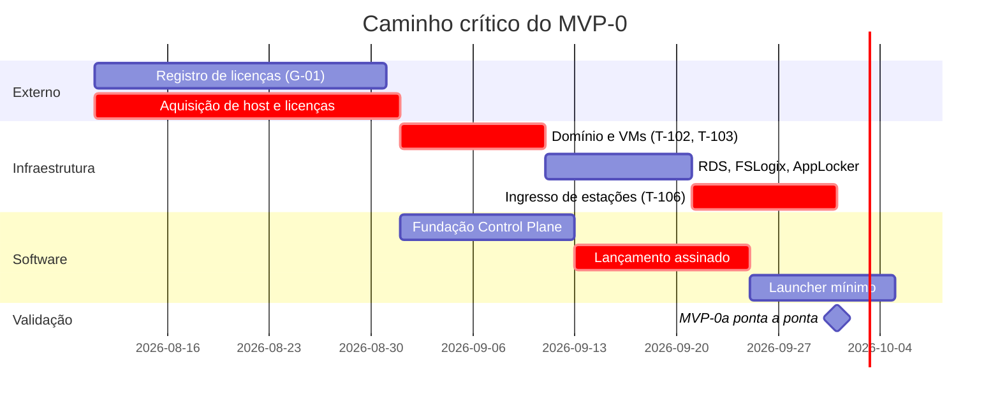

# ROADMAP e BACKLOG — AppBridge
> Entregável 7 de 7 da fase de Design · Sessão S001 · 2026-08-08
> Status: **submetido — aguardando aprovação de Frederico** (RP-04)
> Depende de: todos os entregáveis anteriores e ADR-0001 a ADR-0012
> Alterado após aprovação: ADR-0013 (marcos, §2 e §5) e ADR-0014 (portão G-01)

---

## 1. Como ler este documento

### 1.1 Estimativa relativa

Pontos na escala 1 · 2 · 3 · 5 · 8 · 13. Para permitir a checagem de capacidade da §4, ancoro a
escala:

> `PREMISSA:` (PRE-25) **1 ponto ≈ meio dia de trabalho focado** de um desenvolvedor que conhece a
> stack. É âncora de calibração, não promessa. A velocidade real é desconhecida — este é o primeiro
> projeto na stack — e só a primeira semana de implementação a revela.

### 1.2 Definição de preparado (uma tarefa pode começar quando)

Tem requisito rastreado · tem critério de aceite verificável · as decisões que ela depende estão em
ADR aceito · nenhuma premissa bloqueante em aberto.

### 1.3 Definição de pronto (RP-08, RNF-050)

Código com plano de teste · testes passando · **documentação atualizada** · rastreabilidade
requisito↔código · nenhuma pendência de segurança nova sem registro.

---

## 2. Linha do tempo — vigente

> **Replanejada e aprovada em 2026-08-08 (ADR-0013, opção A).** A §4 mostra por quê; a §5 detalha o
> recorte. A linha do tempo original de P8 está preservada abaixo para comparação.

| Marco | Data vigente | Conteúdo |
|-------|-------------|----------|
| **M1 · Design fechado** | ✅ **2026-08-08** | 7 entregáveis aprovados, 13 ADRs aceitos |
| **M2a · MVP-0a — esqueleto ambulante** | meados de out/2026 | Um usuário, um aplicativo, ponta a ponta, com `.rdp` assinado, trilha e V-01/V-05/V-06 |
| **M2b · MVP-0b — dogfood real** | dez/2026 a jan/2027 | CS-01 a CS-04 integralmente |
| **M2c · MVP-1 (subconjunto do piloto)** | fev a mar/2027 | **Escopo a definir — B-009, R-025** |
| **M3 · Piloto Caminho B** | **abr–jun/2027** | CS-05, 3–5 escritórios pagantes, portões G-01 a G-05 cumpridos |

| Marco original (P8) | Data | Situação |
|---------------------|------|----------|
| Design fechado | fim de ago/2026 | Antecipado |
| MVP-0 completo | meados de out/2026 | **Substituído por M2a + M2b** (ADR-0013) |
| Piloto | 1º tri/2027 | **Substituído por M3 em abr–jun/2027** (ADR-0013) |

---

## 3. Backlog MVP-0

### E-01 · Infraestrutura base — 34 pts · **caminho crítico**

> Não é código, e é a maior fonte de risco de calendário (T-006). Depende de terceiros, de compra e
> de disponibilidade de máquinas e pessoas.

| ID | Tarefa | Critério de aceite | Est. |
|----|--------|--------------------|------|
| T-101 | Adquirir host, Windows Server 2025 e RDS CALs por usuário | Nota fiscal e licenças ativadas; PRE-04 e PRE-18 confirmadas | 3 |
| T-102 | Hyper-V com **AB-DC01 e AB-RDS01 separados** | Duas VMs ativas; `whoami /priv` na AB-RDS01 não mostra usuário final com logon local no DC (ADR-0002, RNF-007) | 5 |
| T-103 | Promover AB-DC01 a controlador de domínio, com sufixo de UPN roteável | Domínio funcional; UPN compatível com o Entra (ADR-0001, riscos) | 5 |
| T-104 | Instalar a pilha RDS na AB-RDS01 e publicar um RemoteApp de teste | RemoteApp abre por `.rdp` manual | 5 |
| T-105 | FSLogix + AppLocker/WDAC em allowlist | Perfil em container; binário não publicado é bloqueado (V-08, RNF-006, RNF-011) | 5 |
| T-106 | **Ingressar as estações no domínio** e aplicar as GPOs: delegação de credenciais restrita, política de redirecionamento, impressão digital do certificado | Estação abre RemoteApp sem pedir senha; disco local não redireciona; `.rdp` não assinado é recusado (ADR-0008, ADR-0009, ADR-0010) | 8 |
| T-107 | Malha privada com ACL restringindo alcance ao 3389; **varredura externa** | V-01 executada e registrada; nenhuma porta RDP visível (CS-04, ADR-0003) | 3 |

**Aceite do épico:** um usuário real abre um RemoteApp a partir da sua estação, sem digitar senha,
sem `mstsc` manual, com a porta 3389 comprovadamente fechada para a internet.

### E-02 · Fundação do Control Plane — 24 pts

| ID | Tarefa | Critério de aceite | Est. |
|----|--------|--------------------|------|
| T-201 | Esqueleto ASP.NET Core, health check, log estruturado com `correlationId` | `/health` responde; um lançamento é rastreável ponta a ponta pelo log (RNF-039, RNF-040) | 3 |
| T-202 | EF Core + PostgreSQL + primeira migração **já com `tenant_id` em todas as tabelas** | Migração aplica e reverte (RNF-052, ADR-0011) | 5 |
| T-203 | `TenantContext` + filtro global no `DbContext` | Consulta sem cláusula explícita não retorna dado de outro tenant (ADR-0004) | 5 |
| T-204 | **Chaves estrangeiras compostas com `tenant_id`** | Tentativa de gravar referência cruzada é recusada **pelo banco** (ADR-0011 §4) | 3 |
| T-205 | `AuditWriter` transacional | Falha simulada de gravação **nega** a operação (V-05, ADR-0007) | 5 |
| T-206 | **Teste automatizado de violação de tenant** | V-02 na suíte; leitura e escrita cruzadas falham (ADR-0004 item 9) | 3 |

### E-03 · Identidade e autorização — 21 pts

| ID | Tarefa | Critério de aceite | Est. |
|----|--------|--------------------|------|
| T-301 | `POST /auth/session`, com registro na mesma transação | Login gera `access_event`; falha de trilha devolve `503 AUDIT_UNAVAILABLE` | 8 |
| T-302 | Vínculo identidade → conta AD por **SID** | Renomear a conta no AD não quebra o vínculo nem a trilha (RF-002) | 5 |
| T-303 | Refresh, logout e armazenamento no Credential Manager | Token renova sem login; logout invalida (RF-004..RF-006) | 5 |
| T-304 | `AuthorizationService` com vigência de permissão | Permissão revogada nega o lançamento seguinte em ≤ 60 s (V-07, RNF-030) | 3 |

### E-04 · Catálogo — 11 pts

| ID | Tarefa | Critério de aceite | Est. |
|----|--------|--------------------|------|
| T-401 | Seed de aplicativos em JSON/tabela | Catálogo carregado sem painel (RF-012) | 3 |
| T-402 | `GET /applications` com filtro por autorização | Aplicativo não autorizado **não aparece** (RF-011) | 3 |
| T-403 | `ETag` / `If-None-Match` | Segunda sincronização devolve `304` (RF-015) | 2 |
| T-404 | Endpoint de ícone | Serve PNG com cache; resolve PD-03 | 3 |

### E-05 · Lançamento — 29 pts · **coração do produto**

| ID | Tarefa | Critério de aceite | Est. |
|----|--------|--------------------|------|
| T-501 | `RdpDescriptorBuilder` aplicando a política de redirecionamento | `.rdp` gerado nega unidades locais e permite impressora (ADR-0008) | 5 |
| T-502 | `IRdpFileSigner` + `RdpSignExeSigner` | `.rdp` assinado e aceito pela estação; **falha de assinatura devolve `503`** (V-06, RNF-002, ADR-0009) | 8 |
| T-503 | `ISessionBackend` + `RdsSessionBackend` (resolução de host e descritor) | Nenhuma regra de negócio referencia tipo do RDS (RNF-035) | 8 |
| T-504 | `POST /launches` com autorização, trilha e `Idempotency-Key` | Repetir a chave não cria segundo lançamento nem segunda contagem (ADR-0012 §3) | 5 |
| T-505 | Catálogo de erros com códigos estáveis | Cada situação da tabela de `API.md` §9 devolve o código correto | 3 |

### E-06 · Sessão e reconciliação — 16 pts

| ID | Tarefa | Critério de aceite | Est. |
|----|--------|--------------------|------|
| T-601 | `SessionRegistry` — início, reutilização e vínculo com o lançamento | Segundo aplicativo reutiliza a sessão (RF-024) | 5 |
| T-602 | `SessionReconciler` contra o Connection Broker, com `reconciled_missing` e `stale_expired` | Sessão encerrada fora do AppBridge é fechada em até um ciclo; **valida PRE-23** (R-009) | 8 |
| T-603 | `GET /sessions/me` | Launcher exibe sessões ativas | 3 |

### E-07 · Trilha e retenção — 13 pts

| ID | Tarefa | Critério de aceite | Est. |
|----|--------|--------------------|------|
| T-701 | Tabelas `launch` e `access_event` append-only | Sem caminho de `UPDATE`/`DELETE` na aplicação (RNF-019) | 5 |
| T-702 | `GET /audit/launches` e `/audit/access-events` | Consulta com filtro e cursor (RF-040) | 3 |
| T-703 | `RetentionWorker` + `purge_run` | Expurgo respeita o mínimo e **registra a si mesmo** (RNF-018, ADR-0007) | 5 |

### E-08 · Launcher — fundação — 26 pts

| ID | Tarefa | Critério de aceite | Est. |
|----|--------|--------------------|------|
| T-801 | Projeto WinUI 3 + MSIX + empacotamento | Instala sem privilégio administrativo; **testa PRE-17** (RNF-044) | 8 |
| T-802 | `ApiClient` com token, renovação e tratamento dos códigos de erro | Cada código produz mensagem em pt-BR acionável (RF-025, RNF-043) | 5 |
| T-803 | `CredentialStore` no Windows Credential Manager | Token não aparece em arquivo nem no SQLite (RF-005) | 3 |
| T-804 | Cache do catálogo em SQLite | Interface abre sem rede, com aviso de estado (RF-014) | 5 |
| T-805 | Interface do catálogo: lista, ícones, estado, latência | Usuário identifica seus aplicativos sem treinamento (RF-026, RNF-042) | 5 |

> **Gatilho do ADR-0005:** se T-801, T-901 e T-902 juntos passarem de **10 pontos reais**, o launcher
> migra para WPF via ADR novo. A medição é objetiva e a decisão já está tomada — só falta o dado.

### E-09 · Launcher — integração com o desktop — 16 pts

| ID | Tarefa | Critério de aceite | Est. |
|----|--------|--------------------|------|
| T-901 | Registro e tratamento de `appbridge://launch/<app>` | Duplo clique no atalho abre o aplicativo (RF-029) | 5 |
| T-902 | "Instalar meus aplicativos": atalhos no Desktop e Menu Iniciar | Atalhos com ícone correto, apontando para o protocolo (RF-030, RF-031) | 5 |
| T-903 | **Remoção de atalho na revogação** | Aplicativo revogado some do Desktop na sincronização seguinte (RF-032) | 3 |
| T-904 | Início com o Windows e ícone na bandeja | Launcher disponível sem o usuário abri-lo (RF-033) | 3 |

### E-10 · Launcher — lançamento e prelaunch — 19 pts

| ID | Tarefa | Critério de aceite | Est. |
|----|--------|--------------------|------|
| T-1001 | `LaunchCoordinator`: pede, grava com TTL, chama `mstsc`, **apaga** | Nenhum `.rdp` sobrevive ao lançamento nem ao TTL (RF-020, RF-022) | 5 |
| T-1002 | SessionPrimer publicado + `PrelaunchService` | Sessão pronta no logon; **valida PRE-22** — o prelaunch sustenta a jornada? (RF-023, R-015) | 8 |
| T-1003 | Medição do tempo de abertura | Número real de RNF-027 registrado, com e sem prelaunch; **valida PRE-11** | 3 |
| T-1004 | Reutilização de sessão no segundo aplicativo | Sem nova sessão, sem nova credencial (RF-024) | 3 |

### E-11 · Segurança e verificação — 16 pts

| ID | Tarefa | Critério de aceite | Est. |
|----|--------|--------------------|------|
| T-1101 | **PS-05** — permissões mínimas da conta de serviço no AD e no banco | Conta sem administração de domínio; documentado (RNF-005) | 3 |
| T-1102 | **PS-09** — limites de taxa por endpoint | `429` com `Retry-After` sob excesso (RNF-010, AM-23) | 3 |
| T-1103 | **PS-10** — procedimento de comprometimento do certificado de assinatura | Documento com passos de rotação e revogação (AM-02) | 2 |
| T-1104 | Executar V-01, V-04, V-05, V-06, V-07, V-08 e registrar | Todas as verificações de MVP-0 com resultado arquivado | 5 |
| T-1105 | Filtro de campos sensíveis no log | Nenhum segredo em log, verificado por amostragem (RNF-004) | 3 |

### E-12 · Operação e dogfood — 16 pts

| ID | Tarefa | Critério de aceite | Est. |
|----|--------|--------------------|------|
| T-1201 | Backup diário + **restauração testada** | V-09 executada em ambiente separado (RNF-033) | 5 |
| T-1202 | Alerta de espaço em disco e de saúde | Disco baixo alerta **antes** de virar indisponibilidade (R-012, AM-22) | 3 |
| T-1203 | **Roteiro operacional**, incluindo o procedimento de desligamento de usuário no MVP-0 | Escrito: desabilitar no AD **e** encerrar sessão manualmente no host (R-014, AM-30) | 3 |
| T-1204 | Semana de dogfood dirigido, com registro de defeitos e medições | CS-01, CS-02 e CS-03 evidenciados | 5 |

---

## 4. Checagem de capacidade — o número inconveniente

| Épico | Pontos |
|-------|--------|
| E-01 Infraestrutura | 34 |
| E-02 Fundação do Control Plane | 24 |
| E-03 Identidade | 21 |
| E-04 Catálogo | 11 |
| E-05 Lançamento | 29 |
| E-06 Sessão | 16 |
| E-07 Trilha | 13 |
| E-08 Launcher — fundação | 26 |
| E-09 Launcher — desktop | 16 |
| E-10 Launcher — lançamento | 19 |
| E-11 Segurança | 16 |
| E-12 Operação | 16 |
| **Total MVP-0** | **241** |

Com a âncora de PRE-25 (1 ponto ≈ meio dia): **≈ 120 dias de trabalho focado**.

A janela de P8 vai do fim de agosto a meados de outubro: **≈ 32 dias úteis**. E esses dias não são
integrais — Frederico dirige um escritório de contabilidade, o que reduz a dedicação a uma fração
`PREMISSA:` (PRE-26) de talvez 40% a 60%.

| Cenário | Dias disponíveis | Cobertura do escopo |
|---------|------------------|---------------------|
| Dedicação integral | 32 | 27% |
| Dedicação de 50% | 16 | 13% |
| **Se eu estiver errado por um fator de 2** (otimista) | 32 | 53% |

**Conclusão, sem rodeios: o MVP-0 completo não cabe até meados de outubro.** A conclusão é robusta —
mesmo que minha estimativa esteja errada pela metade, o escopo não entra. Isso não é falha de
planejamento: é o que R-006 e R-007 anteciparam, agora com número.

Fingir que cabe produziria o desfecho clássico — cortes decididos às pressas, e o que cai primeiro é
sempre teste, documentação e verificação de segurança, ou seja, exatamente o que distingue este
projeto de um script.

---

## 5. Divisão do MVP-0 — **decidida** (ADR-0013)

Preserva a data de outubro **redefinindo o que ela entrega**, e mantém a disciplina.

### MVP-0a · "Esqueleto ambulante" — ≈ 95 pts · alvo: meados de out/2026

**Um usuário, um aplicativo, um caminho, ponta a ponta e de verdade.**

E-01 completo (34) · E-02 completo (24) · T-301, T-304 (11) · T-401, T-402 (6) · T-501, T-502, T-503,
T-504 (26) — do launcher, apenas o mínimo para disparar o lançamento, sem MSIX nem atalhos.

**Critério de aceite:** Frederico abre o Domínio Contábil pelo AppBridge, na própria estação, sem
digitar senha, com `.rdp` assinado, registro em trilha e 3389 comprovadamente fechado (V-01, V-05,
V-06).

**Por que este recorte e não outro:** ele valida cedo as três premissas que podem derrubar o desenho
— PRE-22 (prelaunch), PRE-23 (Connection Broker) e PRE-11 (tempo de abertura). Descobrir em outubro
que o prelaunch não sustenta a jornada é recuperável; descobrir em janeiro, na véspera do piloto, não é.

### MVP-0b · "Dogfood real" — ≈ 146 pts · alvo: dez/2026 a jan/2027

Todo o restante: launcher empacotado, atalhos, prelaunch, reconciliação, retenção, segurança e a
semana de dogfood dirigido. **Critério de aceite: CS-01 a CS-04 integralmente.**

### Efeito no piloto — **decidido: opção A**

M3 no 1º trimestre de 2027 seria inviável com dogfood terminando em janeiro. Frederico escolheu a
**opção A em 2026-08-08**: o piloto vai para **abr–jun/2027**, mantendo 3–5 escritórios.

| Opção | Consequência | Situação |
|-------|--------------|----------|
| **A — Piloto no 2º tri/2027** | Mais seguro. Dá folga para T-001 (G-01), T-002, T-003, PS-02 e PS-03 | ✅ **Escolhida** (ADR-0013) |
| B — Piloto reduzido no 1º tri: 1 escritório, sem cofre | Valida o modelo comercial cedo, com risco operacional maior | Recusada |
| C — Manter 3–5 escritórios no 1º tri | Levaria a produção um sistema sem dogfood completo, sem PS-02 e sem V-09 | Recusada |

> **Consequência que o adiamento cria — R-025.** Com o dogfood terminando em janeiro e o piloto
> começando em abril, sobram ~3 meses para os épicos E-13 a E-18. Pela mesma aritmética da §4, **o
> MVP-1 completo provavelmente não cabe nessa janela** — ele é o novo gargalo. É preciso definir o
> subconjunto mínimo exigido pelo piloto (**B-009**). Recomendação preliminar: priorizar **E-15**
> (encerramento de sessão, que fecha R-014/AM-30), **E-16** (metering mínimo, o único diferencial
> presente no piloto) e a parte de permissões do **E-13**; adiar favoritos (RF-017), atualização
> automática (RF-035) e exportação (RNF-021).

---

## 6. O que cortar, se ainda faltar prazo — nesta ordem

Ordem decidida agora, com a cabeça fria, e **não no meio do aperto**.

| Ordem | Item | Perda |
|-------|------|-------|
| 1º | T-403 `ETag` (2) | Sincronização mais cara; nada visível |
| 2º | T-904 bandeja (3) | Usuário abre o launcher manualmente |
| 3º | T-702 endpoint de consulta da trilha (3) | Consulta por SQL até o painel do MVP-1 |
| 4º | T-603 `GET /sessions/me` (3) | Launcher não mostra sessões ativas |
| 5º | T-1003 medição formal (3) | Perde-se o número de RNF-027 — **é perda de conhecimento, não de função** |
| 6º | T-805 latência (parte de 5) | Sem indicador de latência (RF-026 é Should) |

**Abaixo desta linha estão apenas requisitos Must, e cortar qualquer um exige ADR** (RP-07). Em
particular, **não cortar**: T-205 (auditoria transacional), T-206 (teste de tenant), T-502
(assinatura), T-1104 (verificações) e T-1201 (restauração testada) — são os itens que sustentam as
afirmações de `SEGURANCA.md` §10.

---

## 7. Fases seguintes — épicos

### MVP-1 · painel, metering e reconexão

| Épico | Conteúdo | Requisitos |
|-------|----------|-----------|
| E-13 | Painel Blazor: aplicativos, usuários, grupos, permissões | RF-043, RF-044 |
| E-14 | Trilha administrativa e consulta com exportação | RF-041, RF-046, RNF-017, RNF-021 |
| E-15 | **Encerramento de sessão** — fecha R-014/AM-30 | RF-008, RF-045 |
| E-16 | **Metering mínimo** (ADR-0006) | RF-062..RF-064 |
| E-17 | Reconexão robusta, atualização automática do cliente, favoritos | RF-027, RF-035, RF-017 |
| E-18 | Segurança: PS-01, PS-04, PS-06 | AM-02, AM-20, AM-32 |

### Portão de entrada do piloto — **nenhum é negociável**

| Portão | Item | Risco coberto |
|--------|------|---------------|
| **G-01** | **Declaração de titularidade e conformidade de licença assinada pelo cliente**, anexa ao contrato (ADR-0014). O cliente adquire, instala e usa suas próprias licenças | **R-001 (reescrito)** — a declaração aloca a responsabilidade; não elimina o resíduo do Caminho B |
| **G-02** | T-003 — cotação SPLA validando PRE-05 | R-003 |
| **G-03** | PS-02 e V-09 executados | AM-16, AM-25 |
| **G-04** | Decisão sobre PS-03 (encadeamento da trilha) | R-021 |
| **G-05** | Revisão do ADR-0003 (malha privada não é vendável) e de PS-08 (área de transferência) | R-010, R-011 |

> **G-01 mudou de natureza em ADR-0014.** Deixou de ser consulta a fornecedor e passou a ser
> declaração do cliente. Continua intransponível — cliente sem declaração assinada não entra no
> piloto —, mas não depende mais de terceiro sem prazo de resposta. O que ele **não** faz é eliminar
> o resíduo: alguns termos de licença restringem execução em infraestrutura operada por terceiro
> independentemente de quem detém a licença, e nesse caso a declaração não protege o provedor.

### V2 · Agent, cofre, metering completo, acesso externo

E-19 Agent · E-20 **Cofre de certificados** (bloqueado por T-002 e **B-006/PS-07**) · E-21 fila de
espera e relatórios · E-22 RD Gateway + MFA · E-23 cliente web · E-24 políticas pelo painel.

### V3 · Orquestrador, comercial

E-25 Orquestrador de atualizações · E-26 balanceamento · E-27 branding · E-28 cobrança · E-29 AVD
(prova de RNF-035, fecha R-018).

---

## 8. Caminho crítico e dependências externas

**Dependências fora do controle do projeto:** prazo de entrega do hardware · ativação das licenças ·
disponibilidade das estações e das pessoas para T-106 ·
parecer do advogado em T-002 (bloqueia V2, não MVP-0).

---

## 9. Critérios de aceite da fase MVP-0

| # | Critério | Verificação |
|---|----------|-------------|
| CS-01 | Um dia inteiro de trabalho real via AppBridge, sem `mstsc` manual | T-1204 |
| CS-02 | Atualização feita uma vez no servidor reflete para todos | T-1204 |
| CS-03 | Todo lançamento gera registro auditável | T-702, V-05 |
| CS-04 | Nenhuma porta RDP exposta | **V-01, com resultado arquivado** |
| — | Verificações V-01, V-04 a V-08 executadas e registradas | T-1104 |
| — | Restauração de backup validada | T-1201, V-09 |

---

## 10. Riscos de execução

| ID | Risco | Mitigação neste plano |
|----|-------|----------------------|
| R-006 | Execução solo de projeto com quatro componentes | Divisão em MVP-0a/0b; ordem de corte decidida a frio (§6) |
| R-007 | Densidade de requisitos Must no MVP-0 | §4 quantifica; §5 replaneja |
| **R-023** | **A infraestrutura (E-01, 34 pts) é o caminho crítico e não é código** — depende de compra, de terceiros e da agenda das pessoas | Iniciar E-01 **antes** de qualquer linha de código; T-101 e G-01 podem começar hoje |
| R-001 | Licenciamento (reescrito por ADR-0014): responsabilidade é do cliente; resta o resíduo de termos que vedam infraestrutura operada por terceiro | G-01 na forma de declaração assinada; resíduo para o advogado de T-002 |
| R-015 | Prelaunch não medido | T-1002 e T-1003 dentro do MVP-0a/0b, não no fim |
| R-020 | Cofre sem impedimento técnico ao provedor | E-20 bloqueado por B-006/PS-07 |
| **R-025** | **O MVP-1 é o novo gargalo:** ~3 meses entre o fim do dogfood (jan/2027) e o piloto (abr/2027) para os épicos E-13 a E-18 | Definir subconjunto mínimo do piloto — **B-009**, com recomendação preliminar na §5 |

---

## 11. Premissas introduzidas por este documento

| ID | Premissa | Impacto se errada |
|----|----------|-------------------|
| **PRE-25** | 1 ponto ≈ meio dia de trabalho focado | Toda a §4 escala junto — mas a conclusão sobrevive a erro de 2× |
| **PRE-26** | Dedicação de 40% a 60% do tempo útil ao projeto | Se for menor, MVP-0a também não cabe em outubro e M2 precisa de nova data |
