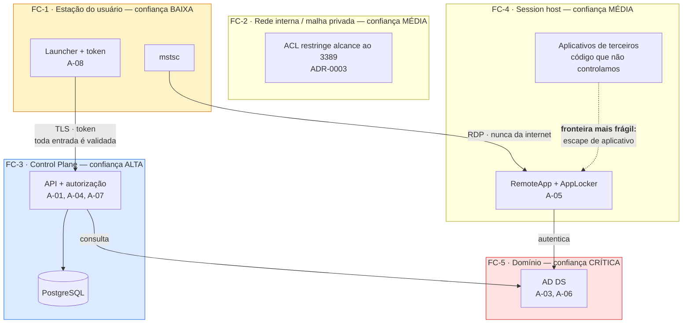

# SEGURANÇA — AppBridge
> Entregável 6 de 7 da fase de Design · Sessão S001 · 2026-08-08
> Status: **✅ aprovado por Frederico em 2026-08-08** (RP-04)
> Depende de: `ARQUITETURA.md`, `MODELO-DE-DADOS.md`, `API.md`, ADR-0001 a ADR-0012
> Decisão posterior que a afeta: **ADR-0014** — o licenciamento dos aplicativos é do cliente (altera R-001, não altera ameaça alguma)

---

## 1. Como ler este documento

Modelo de ameaças **STRIDE simplificado**, aplicado às fronteiras de confiança da arquitetura. Para
cada ameaça: controles existentes (com o requisito ou ADR que os institui) e **estado honesto**.

| Estado | Significado |
|--------|-------------|
| ✅ **Mitigado** | Existe controle que impede ou torna impraticável |
| 🟡 **Parcial** | Controle reduz, não elimina. A residual está declarada |
| 🔵 **Aceito** | Risco conhecido, conscientemente assumido nesta fase, com data de revisão |
| 🔴 **Pendente** | Sem controle definido. É dívida de segurança, não "cuidaremos depois" |

**Regra deste documento:** nenhuma ameaça sai da tabela por ser incômoda. Ameaça sem controle vira
🔴 e entra em `STATUS.md` — inclusive as que atingem os diferenciais de venda do produto.

---

## 2. Ativos — o que vale a pena atacar

Ordenados pelo dano que causam se perdidos.

| # | Ativo | Onde vive | Por que é alvo |
|---|-------|-----------|----------------|
| **A-01** | **Chave privada do certificado de assinatura RDP** | Repositório de máquina da VM do Control Plane (ADR-0009) | Permite forjar `.rdp` que **todas as estações confiam**. Um `.rdp` forjado aponta a estação para um host do atacante e pede credencial de domínio |
| **A-02** | **Certificados A1 do cofre e suas senhas** | `certificate` + `certificate_secret`, cifrados (V2) | Assinar em nome de empresas de terceiros. Dano jurídico, não só técnico |
| **A-03** | **Controlador de domínio** | VM AB-DC01 (ADR-0002) | Comprometê-lo é comprometer todas as contas, todas as sessões e o acesso ao restante |
| **A-04** | **Banco do Control Plane** | PostgreSQL | Contém dados de todos os tenants e a trilha inteira |
| **A-05** | **Dados dos aplicativos hospedados** | Session hosts e servidores de arquivos | A contabilidade dos clientes do escritório — o dado que o cliente mais teme perder |
| **A-06** | **Credenciais de domínio dos usuários** | Estações e AD DS | Acesso direto às sessões |
| **A-07** | **Trilha de auditoria** | Tabelas append-only | Apagá-la ou alterá-la encobre tudo o que veio antes |
| **A-08** | **Token de sessão do Control Plane** | Credential Manager da estação | Permite lançar aplicativos como a vítima |

---

## 3. Fronteiras de confiança

**A fronteira mais frágil é FC-4 → FC-5.** Os aplicativos hospedados são código de terceiros (Domínio,
Alterdata, ERPs, legados) executando com a credencial do usuário. Não auditamos esse código, não
controlamos suas atualizações e alguns são antigos. **É por isso que o ADR-0002 tirou o session host
do controlador de domínio** — um escape ali precisa ser contido em FC-4, não desembocar direto em
FC-5.

---

## 4. STRIDE — ameaças e controles

### 4.1 S · Spoofing (falsificação de identidade)

| ID | Ameaça | Controles | Estado |
|----|--------|-----------|--------|
| **AM-01** | Atacante forja `.rdp` apontando a estação para host próprio e coleta credenciais de domínio | Assinatura obrigatória (RF-019, RNF-002); estações confiam apenas na impressão digital distribuída por GPO (ADR-0009); nenhum caminho entrega `.rdp` não assinado (`API.md` §4) | ✅ |
| **AM-02** | **Comprometimento de A-01** (chave de assinatura) permite forjar `.rdp` confiável para todo o parque | Chave não exportável, uso restrito à conta de serviço, rotação documentada (RNF-008); inventário em `signing_certificate` | 🟡 **Parcial** — não há detecção de uso indevido da chave. Ver PS-01 |
| **AM-03** | Roubo do token de sessão (A-08) na estação permite lançar como a vítima | Token de vida curta e renovável (RF-004); armazenamento no Credential Manager (RF-005); trilha registra `workstationName` e IP, permitindo detectar uso a partir de outra máquina | 🟡 **Parcial** — a detecção é posterior, não impeditiva |
| **AM-04** | Agent falso se registra como session host (V2) | Credencial por host emitida no enrollment e revogável (RF-053); aprovação nominal | ✅ (V2) |
| **AM-05** | Falsificação de identidade no login | Autenticação delegada ao provedor (ADR-0001); AppBridge não guarda senha; limitação de taxa (RNF-010) | ✅ |

### 4.2 T · Tampering (adulteração)

| ID | Ameaça | Controles | Estado |
|----|--------|-----------|--------|
| **AM-06** | Adulteração do `.rdp` no disco da estação — trocar host ou liberar redirecionamento negado | Assinatura cobre o arquivo (RF-019); TTL de 60 s e remoção após uso (RF-020); política também aplicada por GPO no host, não só no arquivo (ADR-0008) | ✅ **Duas camadas** — mesmo `.rdp` adulterado esbarra na GPO do host |
| **AM-07** | Cliente envia `tenantId` de outro tenant para ler ou gravar dados alheios | **Não existe o parâmetro** (ADR-0012 §4); filtro global no `DbContext` (ADR-0004); FK composta recusa no motor (ADR-0011 §4); teste de violação obrigatório | ✅ **Três camadas independentes** |
| **AM-08** | Alteração ou remoção de registros da trilha para encobrir ação | Tabelas append-only, sem caminho de `UPDATE`/`DELETE` na aplicação (RNF-019); expurgo só por retenção e ele próprio registrado (`purge_run`) | 🟡 **Parcial** — quem tiver acesso direto ao banco contorna. Ver AM-16 e PS-02 |
| **AM-09** | Escape de aplicativo hospedado para executar código arbitrário no session host | AppLocker/WDAC em allowlist (RNF-006); usuário sem privilégio administrativo (RNF-005); FSLogix isola perfil (RNF-011); DC separado (ADR-0002) contém o alcance | 🟡 **Parcial** — código de terceiros é risco irredutível; o controle limita o alcance, não impede o escape |

### 4.3 R · Repudiation (repúdio)

| ID | Ameaça | Controles | Estado |
|----|--------|-----------|--------|
| **AM-10** | Usuário nega ter aberto um aplicativo ou acessado um dado | Trilha de acesso com quem/o quê/quando/de onde (RNF-015); auditoria bloqueante — não há acesso concedido sem registro (ADR-0007) | ✅ |
| **AM-11** | Usuário nega ter assinado documento com certificado do cofre (V2) | Trilha de uso de certificado, 60 meses, vinculada a política e termo de custódia (RF-042, RNF-016) | 🟡 **Parcial** — ver AM-12, que é o problema de verdade |
| **AM-12** | **Usuário alega que o provedor forjou o registro de assinatura** | Trilha append-only, retenção longa, relógio sincronizado (RNF-020) | 🔴 **Pendente e importante.** A trilha é mantida pelo próprio provedor: num litígio, ela é a palavra dele. Não há carimbo de tempo independente nem encadeamento criptográfico que permita a um terceiro verificar que a trilha não foi reconstruída. **Ver PS-03** |
| **AM-13** | Administrador nega ter concedido acesso indevido | Trilha administrativa com antes/depois e autor (RNF-017); travessia de tenant marcada (`acting_as_provider`) | ✅ |

### 4.4 I · Information disclosure (divulgação indevida)

| ID | Ameaça | Controles | Estado |
|----|--------|-----------|--------|
| **AM-14** | **Vazamento de dados entre tenants** — a contabilidade de um escritório visível a outro | Três camadas de AM-07; `404` em vez de `403` para recurso alheio (ADR-0012 §5); identificadores não enumeráveis (ADR-0011) | ✅ — **e é a ameaça de maior dano do produto**, por isso três camadas |
| **AM-15** | **Travessia de tenant pelo cabeçalho `X-AppBridge-Acting-Tenant`** | Exige papel de operador do provedor; toda requisição com o cabeçalho é auditada, inclusive leitura; tentativa sem papel é registrada (ADR-0012 §4) | 🟡 **Parcial — R-019.** Uma falha na verificação do papel abre a porta inteira. Exige teste dedicado de negativa e revisão de código específica |
| **AM-16** | **Operador do provedor com acesso ao banco lê dados de todos os tenants** | Menor privilégio (RNF-005); trilha administrativa; separação do Control Plane do session host antes do piloto (ADR-0002) | 🔵 **Aceito** — é inerente ao Caminho B. Quem opera a infraestrutura pode ler o que nela está. O controle é contratual e de detecção, **não de prevenção**. Precisa estar no contrato do piloto |
| **AM-17** | **Exfiltração pela área de transferência** — copiar dado do sistema contábil para a estação | Unidades locais negadas (ADR-0008); área de transferência **liberada por decisão** | 🔵 **Aceito no MVP-0 (R-011)** — dado é do próprio escritório. **Muda de natureza no Caminho B**, onde é dado de terceiros. Revisão obrigatória antes do piloto |
| **AM-18** | Vazamento de detalhe interno em mensagem de erro | Problem Details sem host, caminho, SQL ou exceção (RNF-043, ADR-0012 §2); diagnóstico só via `correlationId` | ✅ |
| **AM-19** | Backup do banco vaza e expõe cofre de certificados | Cifragem envelopada com chave **fora do banco** (RNF-013); senha do PFX em tabela separada com chave distinta (`MODELO-DE-DADOS` §9) | ✅ (V2) — `pg_dump` sozinho é insuficiente |
| **AM-20** | Segredo em código, log ou documento | Proibição explícita (RNF-004); `.gitignore` cobre `*.pfx`, `.env`, `secrets.json`; API nunca devolve PFX nem senha, para papel nenhum | 🟡 **Parcial** — falta varredura automática de segredo no repositório. Ver PS-04 |
| **AM-21** | Captura de tráfego RDP na rede | TLS na camada RDP; 3389 nunca exposto à internet (RNF-001); malha privada cifrada (ADR-0003) | ✅ |

### 4.5 D · Denial of service

| ID | Ameaça | Controles | Estado |
|----|--------|-----------|--------|
| **AM-22** | **Disco cheio no banco paralisa novos lançamentos** — consequência direta da auditoria bloqueante | Alerta de espaço em disco e health check (RNF-040); expurgo por retenção funcionando desde o MVP-0 (RNF-018) | 🔵 **Aceito e intencional (R-012)** — é o preço de ADR-0007. Sessões abertas continuam (RNF-032) |
| **AM-23** | Força bruta ou enumeração no endpoint de autenticação | Limitação de taxa e bloqueio progressivo (RNF-010); `429` com `Retry-After` | 🟡 **Parcial** — limites concretos ainda não definidos (PD-05) |
| **AM-24** | Contagem de licença inflada bloqueia trabalho legítimo | `reconciled_missing` e `stale_expired` (`MODELO-DE-DADOS` §6.2); `Idempotency-Key` (ADR-0012 §3); reconciliação manual pelo administrador (`API.md` §6) | 🟡 **Parcial (R-009)** — depende de PRE-23, ainda não medida |
| **AM-25** | Host único de infraestrutura no MVP-0 é ponto único de falha | Backup diário com restauração testada (RNF-033) | 🔵 **Aceito no MVP-0**, inaceitável no piloto (ADR-0002, riscos) |
| **AM-26** | Ransomware nos session hosts ou no servidor de arquivos | AppLocker/WDAC (RNF-006); usuário sem privilégio (RNF-005); backup (RNF-033) | 🟡 **Parcial** — NO-07: não somos EDR. Depende de controles do cliente |

### 4.6 E · Elevation of privilege

| ID | Ameaça | Controles | Estado |
|----|--------|-----------|--------|
| **AM-27** | **Usuário final com logon local no controlador de domínio** | **Eliminada por desenho:** DC e session host em VMs separadas (ADR-0002, RNF-007) | ✅ — era R-005, fechado |
| **AM-28** | Delegação de credenciais ampla (`TERMSRV/*`) permite entregar a credencial do usuário a qualquer servidor | Delegação restrita aos session hosts nominados (ADR-0010, item 2) | ✅ |
| **AM-29** | Usuário comum acessa endpoints administrativos | Autorização por papel, sempre no servidor (RF-021); nenhuma decisão no cliente | ✅ |
| **AM-30** | **Revogação não alcança sessão já aberta no MVP-0** | Novos lançamentos negados em 60 s (RNF-030); atalhos removidos (RF-032) | 🔴 **Pendente no MVP-0 (R-014)** — quem está dentro continua. Resposta operacional: desabilitar conta no AD **e** encerrar sessão manualmente no host. Resolvido por RF-008 no MVP-1 |
| **AM-31** | Conta de serviço do Control Plane com privilégio excessivo no AD | Menor privilégio (RNF-005): leitura no diretório e uso do certificado, sem administração de domínio | 🟡 **Parcial** — o conjunto exato de permissões ainda não foi especificado. Ver PS-05 |
| **AM-32** | Comprometimento da cadeia de suprimentos: dependência maliciosa no launcher ou no Control Plane | MSIX assinado (RF-034); AppLocker impede binário não autorizado no host | 🔴 **Pendente** — não há política de verificação de dependências. Ver PS-06 |

### 4.7 Ameaça específica do diferencial — o cofre (V2)

| ID | Ameaça | Controles | Estado |
|----|--------|-----------|--------|
| **AM-33** | **Operador do provedor usa certificado A1 de um cliente para assinar sem autorização** | Política de uso por usuário × titular × aplicativo × vigência (RF-057); termo de custódia obrigatório (RF-056); registro de cada uso (RF-042) | 🔴 **Pendente — e precisa ser dito com todas as letras.** Quem tem acesso à chave de cifragem e ao banco pode, tecnicamente, assinar. A proteção do AppBridge contra um operador mal-intencionado é **detecção pela trilha, não prevenção**. Ver PS-07 |

> **Por que isso está escrito aqui em vez de suavizado:** DIF-01 é vendido como diferencial e envolve
> assinar em nome de terceiros. Um cliente que pergunte "o que impede vocês de assinarem por mim?"
> merece resposta honesta. Hoje ela é: o termo de custódia, a trilha de 60 meses e a
> responsabilização contratual — não um impedimento técnico. Fingir o contrário seria vender o que o
> produto não tem, e a conta chegaria em juízo. Ver PS-07 para o caminho de mitigação real.

---

## 5. Pendências de segurança

Consolidação de tudo marcado 🔴 e das residuais 🟡 que exigem ação. **Nenhuma some por omissão.**

| ID | Pendência | Ameaça | Prazo proposto |
|----|-----------|--------|----------------|
| **PS-01** | Detecção de uso indevido da chave de assinatura (A-01): alertar quando a taxa de assinatura fugir do padrão | AM-02 | MVP-1 |
| **PS-02** | Restringir o acesso direto ao banco e registrar sessões administrativas de banco de dados | AM-08, AM-16 | Antes do piloto |
| **PS-03** | **Encadeamento criptográfico da trilha** (hash da linha anterior em cada registro) e/ou carimbo de tempo independente, para que um terceiro possa verificar que a trilha não foi reconstruída | AM-12 | **Antes do piloto** — alteraria ADR-0007, exige ADR novo |
| **PS-04** | Varredura automática de segredos no repositório, no fluxo de integração | AM-20 | MVP-1 |
| **PS-05** | Especificar o conjunto mínimo de permissões da conta de serviço no AD e no banco | AM-31 | MVP-0 (implantação) |
| **PS-06** | Política de dependências: fixação de versão, verificação de vulnerabilidades conhecidas, revisão de nova dependência | AM-32 | MVP-1 |
| **PS-07** | **Reduzir o poder unilateral do provedor sobre o cofre** — as opções conhecidas são exigir uma segunda aprovação para uso de certificado, manter a senha do PFX sob custódia do titular, ou usar módulo de hardware com política. Nenhuma é gratuita; todas alteram o produto | AM-33 | **Antes de o cofre entrar em produção (V2)** — exige ADR e parecer jurídico (T-002) |
| **PS-08** | Revisão da liberação de área de transferência à luz do dado de terceiros | AM-17 | Antes do piloto |
| **PS-09** | Definir limites concretos de taxa por endpoint | AM-23, PD-05 | MVP-0 |
| **PS-10** | Procedimento escrito de resposta a comprometimento do certificado de assinatura | AM-02 | MVP-0 |

---

## 6. Gestão de segredos

| Segredo | Onde vive | Nunca aparece em |
|---------|-----------|------------------|
| Chave privada de assinatura RDP | Repositório de máquina, não exportável | Banco, código, backup do banco |
| Chave de cifragem do cofre (V2) | Fora do banco (RNF-013) | Banco, `pg_dump`, código |
| Cadeia de conexão do banco | Variável de ambiente ou cofre do sistema | Código, `appsettings` versionado, log |
| Credencial do Agent (V2) | Repositório de segredo do host | Banco em claro, log |
| Token de sessão do usuário | Windows Credential Manager | Arquivo, SQLite local, log |
| **Senha de domínio do usuário** | **Somente no Windows** | **Em lugar nenhum do AppBridge, em nenhuma forma** (ADR-0010) |

Regras: rotação documentada para cada um · nenhum segredo em mensagem de commit · `.gitignore` cobre
`*.pfx`, `*.p12`, `.env`, `secrets.json` · toda gravação de log passa por filtro que remove campos
sensíveis conhecidos (RNF-004).

---

## 7. Verificações obrigatórias

Controle sem verificação é intenção. Estas verificações são **critério de aceite**, não sugestão.

| # | Verificação | Comprova | Quando |
|---|-------------|----------|--------|
| **V-01** | **Varredura externa** contra o IP público do escritório, com resultado registrado | RNF-001, CS-04 — nenhuma porta RDP exposta | MVP-0, e a cada mudança de rede |
| **V-02** | **Teste automatizado de violação de tenant**: tentar ler e gravar dados de outro tenant e exigir falha | AM-07, AM-14, ADR-0004 item 9 | Toda execução da suíte |
| **V-03** | **Teste de negativa do cabeçalho de travessia**: token sem papel de operador enviando `X-AppBridge-Acting-Tenant` deve receber `403` e gerar registro | AM-15, R-019 | Toda execução da suíte |
| **V-04** | Tentativa de lançamento com `.rdp` adulterado deve falhar na estação | AM-06 | MVP-0, manual |
| **V-05** | Simular indisponibilidade de gravação da trilha e confirmar que o lançamento é **negado** | ADR-0007, AM-22 | MVP-0 |
| **V-06** | Simular falha de assinatura e confirmar que nenhum `.rdp` é entregue | RNF-002, AM-01 | MVP-0 |
| **V-07** | Revogar acesso e cronometrar a negativa do lançamento seguinte (≤ 60 s) | RNF-030 | MVP-0 |
| **V-08** | Confirmar que AppLocker/WDAC bloqueia binário não publicado no session host | RNF-006, AM-09 | MVP-0 |
| **V-09** | Restaurar o backup do banco em ambiente separado e validar a restauração | RNF-033, AM-25 | Antes do piloto |

---

## 8. Fora de escopo de segurança

Declarado para que ninguém suponha cobertura que não existe (NO-07).

- **Antivírus, EDR e firewall de estação** — responsabilidade do cliente. O AppBridge reduz a
  exposição ao manter dado e aplicativo no servidor; não protege a estação.
- **Segurança física** do host e da rede do escritório.
- **Segurança dos aplicativos hospedados** — Domínio, Alterdata e ERPs são código de terceiros
  (NO-04). Vulnerabilidade neles não é vulnerabilidade nossa, mas **o alcance do dano é problema
  nosso**, e é isso que AM-09 e ADR-0002 endereçam.
- **Estações fora de suporte** (R-008): Windows 10 sem atualização de segurança é risco do cliente.

---

## 9. Rastreabilidade — ameaça → controle → requisito

| Categoria STRIDE | Ameaças | Requisitos e ADRs principais |
|------------------|---------|------------------------------|
| Spoofing | AM-01..AM-05 | RF-004, RF-005, RF-019, RF-053, RNF-002, RNF-008, RNF-010 · ADR-0009 |
| Tampering | AM-06..AM-09 | RF-019, RF-020, RNF-005, RNF-006, RNF-011, RNF-019, RNF-036 · ADR-0004, 0008, 0011, 0012 |
| Repudiation | AM-10..AM-13 | RF-036..RF-042, RNF-015..RNF-017, RNF-020 · ADR-0007 |
| Information disclosure | AM-14..AM-21 | RNF-001, RNF-004, RNF-013, RNF-043 · ADR-0003, 0008, 0011, 0012 |
| Denial of service | AM-22..AM-26 | RNF-010, RNF-018, RNF-032, RNF-033, RNF-040 · ADR-0006, 0007 |
| Elevation of privilege | AM-27..AM-32 | RF-008, RF-021, RF-034, RNF-005, RNF-007, RNF-030 · ADR-0002, 0010 |
| Cofre (V2) | AM-33 | RF-042, RF-055..RF-059, RNF-013, RNF-016 · T-002 |

---

## 10. Resumo executivo — o que um cliente do piloto precisa ouvir

Três afirmações que o produto sustenta hoje, e três que **ainda não**.

**Sustenta:**
1. A porta RDP nunca esteve exposta à internet, e isso é verificável por varredura (V-01).
2. Nenhum acesso é concedido sem registro — a trilha está na mesma transação que a autorização.
3. Dados de escritórios diferentes não se misturam, com três camadas independentes de isolamento e
   teste automatizado que tenta violá-las.

**Ainda não sustenta — e não deve ser prometido:**
1. **Que o provedor não possa usar o certificado do cliente** (AM-33). Hoje o impedimento é
   contratual e a proteção é a trilha. PS-07 é o caminho técnico, e ele custa.
2. **Que a trilha seja verificável por terceiro** (AM-12). Ela é mantida pelo provedor; sem
   encadeamento criptográfico, num litígio é a palavra dele. PS-03.
3. **Que revogar acesso encerre a sessão aberta** no MVP-0 (AM-30). Só a partir do MVP-1.
