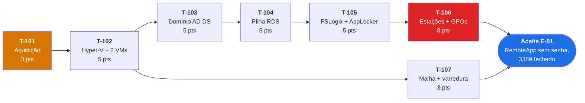

# E-01 — Infraestrutura base
> Épico do MVP-0a · **34 pts** · Caminho crítico · Risco **R-023** · Sessão S005 · 2026-08-08

---

## 1. O que é este épico e por que ele lidera

E-01 é o maior épico do MVP-0a e **não é código**: é compra, instalação e configuração. Depende de
prazo de fornecedor, de disponibilidade de máquinas e da agenda das pessoas do escritório — variáveis
que nenhum esforço de programação acelera.

Por isso ele começa **antes da primeira linha de código** (R-023, ADR-0013 item 4). E-02 em diante
depende de E-01 existir.

## 2. Arquivos

| Arquivo | Conteúdo |
|---------|----------|
| `T-101-especificacao-de-aquisicao.md` | O que comprar, com justificativa de dimensionamento, licenças e o que perguntar ao revendedor sobre SPLA (T-003) |
| `roteiro-implantacao.md` | Passo a passo de T-102 a T-107, com verificação por passo |

## 3. Ordem e dependências

**Em laranja, o que trava tudo:** T-101 é a única dependência externa restante do início do MVP-0a,
depois que ADR-0014 tirou a consulta a fornecedores do caminho crítico.

**Em vermelho, o que mais estoura prazo:** T-106 depende de tocar em todas as estações do escritório
e da disponibilidade das pessoas. Deve ser sequenciado cedo, nunca na véspera do teste de CS-01.

T-107 pode correr em paralelo a partir de T-102 — não depende do domínio nem da pilha RDS.

## 4. Aceite do épico

> Um usuário real abre um RemoteApp a partir da sua estação, **sem digitar senha**, sem `mstsc`
> manual, com o disco local não redirecionado e a porta 3389 **comprovadamente** fechada para a
> internet.

Três verificações de segurança são critério de aceite, não formalidade (`SEGURANCA.md` §7):

| # | Verificação | Comprova |
|---|-------------|----------|
| **V-01** | Varredura externa contra o IP público, com resultado arquivado | RNF-001, CS-04 |
| **V-04** | `.rdp` sem assinatura ou adulterado é recusado pela estação | RNF-002, AM-01/AM-06 |
| **V-08** | AppLocker bloqueia binário não publicado no session host | RNF-006, AM-09 |

## 5. Decisões que este épico materializa

| Decisão | O que aparece na prática |
|---------|--------------------------|
| **ADR-0002** | Duas VMs. Usuário final nunca recebe logon local no DC |
| **ADR-0003** | ACL na malha privada; nenhum encaminhamento de porta; varredura externa registrada |
| **ADR-0008** | GPO de redirecionamento: impressora e token sim, disco local não |
| **ADR-0009** | Certificado de assinatura com chave não exportável; impressão digital distribuída por GPO |
| **ADR-0010** | Estações no domínio; delegação de credenciais **nominal**, nunca curinga |

Se qualquer uma dessas configurações for afrouxada durante a implantação, **a decisão correspondente
deixa de existir** — e o documento que a sustenta passa a descrever um sistema que não é o real. Nesse
caso, o caminho é registrar em `STATUS.md` e abrir ADR (RA-06), não ajustar em silêncio.

## 6. O que este épico ainda não resolve

- **PRE-22** (o prelaunch sustenta a jornada?) só se confirma com T-1002, já em E-10.
- **PRE-23** (o Connection Broker é confiável para consultar e encerrar sessões?) só em T-602.
- **PRE-27 e PRE-28** (RAM por sessão e tamanho de container) só no dogfood.

São as medições de T-005. E-01 cria as condições para medi-las; não as responde.
